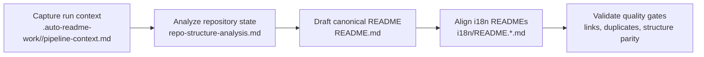

[English](../README.md) · [العربية](README.ar.md) · [Español](README.es.md) · [Français](README.fr.md) · [日本語](README.ja.md) · [한국어](README.ko.md) · [Tiếng Việt](README.vi.md) · [中文 (简体)](README.zh-Hans.md) · [中文（繁體）](README.zh-Hant.md) · [Deutsch](README.de.md) · [Русский](README.ru.md)


<p align="center">
  <a href="https://github.com/lachlanchen/lachlanchen/blob/main/figs/banner.png">
    
  </a>
  <a href="../logos/aginti-logo-wordmark.png">
    
  </a>
</p>


# AgInTi

[](https://github.com/lachlanchen/AgInTi)
[](#aginti)
[](#-بنية-المشروع)
[](#-النطاق-والحالة-الراهنة)
[](#-الترخيص)
[](#-نظرة-عامة)
[](#-الميزات)
[](#-المعمارية)

مستودع تأسيسي يركّز على التوثيق أولًا للحفاظ على README إنجليزي واحد مرجعي ومزامنة وثائق متعددة اللغات، مستندًا إلى ثلاثة مبادئ تشغيلية: **أدوات الخلق الحاد (sear creation tools)**، و**أدوات المعالجة الذاتية (self-healing tools)**، و**سلسلة أدوات الموجّهات (chain of prompt tools)**.


## 🧭 تنقّل سريع

| النوع | الوجهة |
| --- | --- |
| ملخص المشروع | [نظرة عامة](#-نظرة-عامة) |
| القدرات الأساسية | [الميزات](#-الميزات) |
| تصميم خط الأنابيب | [المعمارية](#-المعمارية) |
| خط الأساس الفلسفي | [الفلسفة باختصار](#الفلسفة-باختصار) |
| سير عمل المساهمين | [ملاحظات التطوير](#-ملاحظات-التطوير) |
| الاتجاه المستقبلي | [خارطة الطريق](#-خارطة-الطريق) |
| دعم هذا المشروع | [الدعم](#-support) |

---

## 📌 النطاق والحالة الراهنة

| العنصر | الحالة الحالية |
| --- | --- |
| مرحلة المستودع | هيكل تأسيسي للتوثيق |
| كود التشغيل | غير موجود في اللقطة الحالية |
| الاختبارات/مسارات CI | غير موجودة في اللقطة الحالية |
| التوثيق المترجم | 10 ملفات لغوية ضمن `i18n/` |
| مخرجات خط الأنابيب | تشغيلات مؤرخة ضمن `.auto-readme-work/` |
| ملف الترخيص | غير موجود كملف مستقل (شارة README تعرض `TBD`) |
| خط الأساس الفلسفي | sear creation + self-healing + chain of prompt tools |

## 🌍 نظرة عامة

يعمل AgInTi حاليًا كخط أنابيب لإدارة دورة حياة README وتوطينه، وليس كتطبيق تشغيلي وقت التنفيذ. يُعد `README.md` في الجذر المصدر المرجعي، وتتم مزامنة النسخ المترجمة ضمن `i18n/` انطلاقًا من هذا الهيكل المرجعي.

فلسفة المشروع تشغيلية وليست شكلية. ومن المتوقع أن يلبّي كل تحديث لـ README المبادئ الثلاثة كلها:

1. **أدوات الخلق الحاد (Sear creation tools)**: سير إنشاء مقصود ودقيق يولّد توثيقًا عالي الإشارة من أدلة مستودع محدودة.
2. **أدوات المعالجة الذاتية (Self-healing tools)**: آليات إصلاح موجّهة لإزالة الانحراف والتكرار وعدم الاتساق البنيوي.
3. **سلسلة أدوات الموجّهات (Chain of prompt tools)**: تدفقات موجّهات مرحلية وقابلة للتتبّع تحافظ على تسلسل السياق إلى المخرجات عبر تشغيلات الخط.

يحافظ هذا المستودع على المحتوى التاريخي ذي المعنى عبر تعديلات تدريجية مع إبقاء الروابط الحرجة والأوامر وبيانات الدعم الوصفية.

### الفلسفة باختصار

| المبدأ | الغاية | النتيجة التشغيلية |
| --- | --- | --- |
| **أدوات الخلق الحاد** | إنتاج توثيق عالي الإشارة من أدلة مقيدة. | تبقى الأقسام عملية ومحددة ومرتكزة على المستودع. |
| **أدوات المعالجة الذاتية** | إصلاح الانحراف والتكرار وتقادم البنية. | يبقى README المرجعي والنسخ المترجمة متوافقة ونظيفة. |
| **سلسلة أدوات الموجّهات** | إبقاء مراحل التوليد صريحة وقابلة للتتبّع. | تحفظ مخرجات الخط سياقًا قابلًا لإعادة الإنتاج وتسليمًا واضحًا بين المراحل. |

## ✨ الميزات

- استراتيجية توثيق تعتمد README أولًا مع مستند جذري مرجعي.
- مزامنة متعددة اللغات عبر 10 نسخ README ضمن i18n.
- تأليف موجّه بخط الأنابيب عبر مخرجات `.auto-readme-work/<run-id>/`.
- ثوابت تضمن وجود بانر واحد ولوحة دعم واحدة فقط لمنع الكتل البصرية المكررة.
- انضباط التحديث التدريجي للحفاظ على التاريخ التقني الجوهري.

### ربط المبادئ بالميزات

| المبدأ الأساسي | التجسيد الحالي |
| --- | --- |
| **أدوات الخلق الحاد** | صياغة README دقيقة من أدلة المستودع مع هياكل أقسام مستقرة. |
| **أدوات المعالجة الذاتية** | فحوصات إزالة التكرار للبانر/الدعم المكرر، والمراجع المتقادمة، وانحراف البنية. |
| **سلسلة أدوات الموجّهات** | سلسلة مخرجات خاصة بكل تشغيل (`pipeline-context`، قوالب التنقل، خطة الترجمة) لإخراج قابل لإعادة الإنتاج. |

## 🗂️ بنية المشروع

```text
AgInTi/
├── README.md
├── i18n/
│   ├── README.ar.md
│   ├── README.de.md
│   ├── README.es.md
│   ├── README.fr.md
│   ├── README.ja.md
│   ├── README.ko.md
│   ├── README.ru.md
│   ├── README.vi.md
│   ├── README.zh-Hans.md
│   └── README.zh-Hant.md
└── .auto-readme-work/
    ├── 20260228_184104/
    ├── 20260301_064213/
    ├── 20260301_064740/
    ├── 20260301_065835/
    ├── 20260301_070633/
    ├── 20260302_120620/
    ├── 20260302_124338/
    ├── 20260302_140150/
    └── 20260302_140358/
```

## 🏗️ المعمارية

في هذه المرحلة، تعني المعمارية هنا معمارية خط أنابيب التوثيق، وليست معمارية خدمة تشغيلية وقت التنفيذ.

### تدفق خط الأنابيب



### المبادئ الأساسية داخل المعمارية

- **أدوات الخلق الحاد**: تُطبّق أثناء بناء المحتوى للحفاظ على أقسام ملموسة ومكتملة ودقيقة بالنسبة للمستودع.
- **أدوات المعالجة الذاتية**: تُطبّق أثناء التحقق لإزالة الكتل المكررة، وإصلاح مراجع التشغيل المتقادمة، واستعادة التكافؤ البنيوي.
- **سلسلة أدوات الموجّهات**: تُطبّق عبر المخرجات بحيث تبقى كل مرحلة توليد صريحة وقابلة للتدقيق.

### نقاط تحقق المبادئ حسب مرحلة الخط

| المرحلة | أدوات الخلق الحاد | أدوات المعالجة الذاتية | سلسلة أدوات الموجّهات |
| --- | --- | --- | --- |
| التقاط السياق | تحديد قيود توليد حادّة. | رصد المدخلات الناقصة أو غير الصالحة مبكرًا. | حفظ الموجّه المصدر وبيانات التشغيل الوصفية. |
| الصياغة المرجعية | بناء أقسام README مكتملة من أدلة المستودع. | منع التراجعات وفقدان المحتوى غير المقصود. | إبقاء مخرجات المرحلة مرتبطة بمخرجات سابقة. |
| مواءمة i18n | الحفاظ على التكافؤ البنيوي والتقني بين اللغات. | تصحيح الانحراف بين الجذر وملفات i18n. | نقل مقصد النسخة المرجعية إلى كل نسخة مترجمة. |
| التحقق النهائي | فرض القابلية للقراءة والحفاظ على مستوى التفاصيل. | إزالة تكرار البانر/الدعم والمراجع المتقادمة. | ترك أثر مخرجات قابل للتدقيق لهذا التشغيل. |

## 🧾 مدخلات التوثيق والمخرجات المولّدة

| الملف | الغرض |
| --- | --- |
| `.auto-readme-work/20260302_140358/pipeline-context.md` | قيود وأهداف المصدر لعملية التوليد هذه. |
| `.auto-readme-work/20260302_140358/repo-structure-analysis.md` | ملخص فحص المستودع والحالة التقنية المستنتجة. |
| `.auto-readme-work/20260302_140358/language-nav-root.md` | سطر خيارات اللغات المرجعي لملف `README.md` في الجذر. |
| `.auto-readme-work/20260302_140358/language-nav-i18n.md` | سطر خيارات اللغات المرجعي لملفات README المترجمة. |
| `.auto-readme-work/20260302_140358/translation-plan.txt` | خريطة اللغات وخطة ملفات i18n المستهدفة. |
| `.auto-readme-work/<older-run-id>/...` | سياق تاريخي من تشغيلات خط الأنابيب السابقة. |

## 🔧 المتطلبات المسبقة

- `git`
- POSIX shell (الأمثلة تستخدم `bash`)
- محرر يدعم Markdown

### افتراضات

- لا توجد خدمة قابلة للتشغيل أو ملف تعريف تطبيق ضمن لقطة هذا المستودع.
- لذلك، إرشادات التثبيت والبناء والتشغيل موجّهة لسير عمل التوثيق.

## 📥 التثبيت

لا توجد بعد حزمة ثنائية أو خطوة بناء وقت تشغيل معرفة.

```bash
git clone git@github.com:lachlanchen/AgInTi.git
cd AgInTi
```

## ▶️ الاستخدام

يركّز الاستخدام الحالي على صيانة التوثيق ومزامنة النسخ متعددة اللغات.

### أوامر فحص شائعة

```bash
ls -la
ls -la .auto-readme-work/20260302_140358
ls -la i18n
```

### سير عمل مزامنة README المرجعي

1. اقرأ `.auto-readme-work/20260302_140358/pipeline-context.md`.
2. تحقّق من قوالب محدد اللغة في `language-nav-root.md` و`language-nav-i18n.md`.
3. حدّث `README.md` تدريجيًا بصفته مصدر الحقيقة.
4. واءم ملفات `i18n/README.*.md` مع نفس البنية والتفاصيل التقنية الأساسية.
5. أكّد وجود بانر واحد فقط ولوحة دعم واحدة فقط.

## ⚙️ الإعداد

لا يوجد إعداد وقت تشغيل حتى الآن. سلوك التوثيق تحركه مخرجات المستودع.

- `pipeline-context.md`: أهداف التشغيل والقيود.
- `repo-structure-analysis.md`: أدلة اللقطة والفجوات.
- `language-nav-root.md` و`language-nav-i18n.md`: اتساق التنقل.
- `translation-plan.txt`: اللغات المستهدفة والربط.

## 🧪 أمثلة

### المثال 1: التحقق من قوالب تنقّل اللغة

```bash
cat .auto-readme-work/20260302_140358/language-nav-root.md
cat .auto-readme-work/20260302_140358/language-nav-i18n.md
```

### المثال 2: فحص خطة اللغات

```bash
cat .auto-readme-work/20260302_140358/translation-plan.txt
```

### المثال 3: تأكيد عدم وجود ملفات تعريف التشغيل (اللقطة الحالية)

```bash
find . -maxdepth 2 \
  \( -name package.json -o -name pyproject.toml -o -name go.mod -o -name Cargo.toml -o -name pom.xml \)
```

## 🛠️ ملاحظات التطوير

- حافظ على الأقسام الجوهرية والروابط من تاريخ README المرجعي.
- فضّل التعديلات التدريجية على إعادة الكتابة المدمّرة.
- احتفظ ببانر واحد وكتلة دعم واحدة فقط.
- حافظ على تزامن البنية بين README الجذر وملفات i18n.
- اذكر الافتراضات بوضوح كلما كانت تفاصيل التشغيل أو البنية التحتية غير معروفة.
- طبّق ثلاثية الفلسفة كحواجز توجيهية فعّالة:
  - **أدوات الخلق الحاد** لصياغة عالية الإشارة.
  - **أدوات المعالجة الذاتية** لإصلاح الاتساق.
  - **سلسلة أدوات الموجّهات** لتسليم قابل لإعادة الإنتاج بين مراحل الخط.

## 🚑 استكشاف الأخطاء وإصلاحها

### لا أرى سوى ملفات Markdown ومخرجات خط الأنابيب

هذا متوقع في مرحلة التأسيس الحالية.

### سطور محدد اللغة مختلفة بين الملفات

استخدم القوالب المرجعية في:

- `.auto-readme-work/20260302_140358/language-nav-root.md`
- `.auto-readme-work/20260302_140358/language-nav-i18n.md`

### فرعي متأخر عن المستودع البعيد

```bash
git fetch origin
git pull --ff-only
```

### أريد إضافة إرشادات تشغيل

أضف إرشادات البناء والتشغيل فقط بعد إدخال ملفات تعريف فعلية (على سبيل المثال: `package.json`، `pyproject.toml`، `go.mod`، `Cargo.toml`) والتأكد من مساراتها داخل هذا المستودع.

## 🗺️ خارطة الطريق

1. تعزيز **أدوات الخلق الحاد** عبر قوالب قياسية لصياغة README، وبوابات جودة للأقسام، وفحوصات أوضح من الأدلة إلى المخرجات.
2. توسيع **أدوات المعالجة الذاتية** عبر فحوصات آلية للكتل المكررة، وانحراف اللغات، والروابط الداخلية المعطلة، ومراجع التشغيل المتقادمة.
3. إضفاء طابع رسمي على **سلسلة أدوات الموجّهات** عبر مراحل التشغيل للحصول على آثار سياق/توليد/ترجمة/تحقق قابلة لإعادة الإنتاج.
4. إضافة تدفق صيانة توثيق بأمر واحد عند إدخال سكربتات للمستودع.
5. إضافة فحوصات CI لجودة Markdown وسلامة الروابط وتكافؤ بنية i18n.
6. إدخال مكوّنات تشغيلية فعلية عند إضافة ملفات التعريف ونقاط الدخول.
7. نشر قرار ترخيص مستقر وإضافة ملف ترخيص مستقل.

### خارطة الطريق حسب تركيز المبدأ

| مجال التركيز | الهدف القريب |
| --- | --- |
| **أدوات الخلق الحاد** | تحسين قوالب الصياغة وموجّهات الأقسام المستندة إلى الأدلة. |
| **أدوات المعالجة الذاتية** | أتمتة اكتشاف التكرار وفحوصات الروابط المتقادمة وإصلاح انحراف اللغات. |
| **سلسلة أدوات الموجّهات** | توحيد عقود مخرجات مراحل التشغيل لإنتاج متعدد اللغات قابل لإعادة الإنتاج. |

## 🤝 المساهمة

المساهمات مرحّب بها.

1. افتح issue يصف التغيير المقصود.
2. أنشئ فرعًا مركزًا.
3. اجعل تعديلات التوثيق تدريجية ودقيقة بالنسبة للمستودع.
4. حافظ على الروابط والأوامر والسياق التاريخي الجوهري.
5. افتح pull request مع ملاحظات تحقق موجزة.

### مسار مقترح

```bash
git checkout -b docs/your-update
# edit README.md and/or i18n/README.*.md
git add README.md i18n/README.*.md
git commit -m "docs: refine README content"
git push -u origin docs/your-update
```

## 📄 الترخيص

TBD. من المخطط إضافة ملف ترخيص مستقل، لكنه غير موجود بعد في اللقطة الحالية.


## 🔗 Git Submodules

This repository includes these root submodules:

- [AutoAppDev](https://github.com/lachlanchen/AutoAppDev)
- [AutoNovelWriter](https://github.com/lachlanchen/AutoNovelWriter)
- [OrganoidAgent](https://github.com/lachlanchen/OrganoidAgent)
- [LazyingArtBot](https://github.com/lachlanchen/LazyingArtBot)
- [PaperAgent](https://github.com/lachlanchen/PaperAgent)

## ❤️ Support

| Donate | PayPal | Stripe |
| --- | --- | --- |
| [](https://chat.lazying.art/donate) | [](https://paypal.me/RongzhouChen) | [](https://buy.stripe.com/aFadR8gIaflgfQV6T4fw400) |
