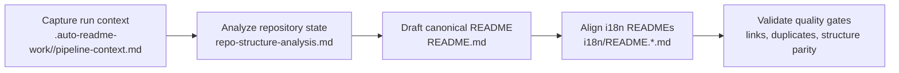

[English](../README.md) · [العربية](README.ar.md) · [Español](README.es.md) · [Français](README.fr.md) · [日本語](README.ja.md) · [한국어](README.ko.md) · [Tiếng Việt](README.vi.md) · [中文 (简体)](README.zh-Hans.md) · [中文（繁體）](README.zh-Hant.md) · [Deutsch](README.de.md) · [Русский](README.ru.md)


<p align="center">
  <a href="https://github.com/lachlanchen/lachlanchen/blob/main/figs/banner.png">
    
  </a>
  <a href="../logos/aginti-logo-wordmark.png">
    
  </a>
</p>


# AgInTi

[](https://github.com/lachlanchen/AgInTi)
[](#aginti)
[](#-projektstruktur)
[](#-umfang-und-aktueller-stand)
[](#-lizenz)
[](#-uberblick)
[](#-funktionen)
[](#-architektur)

Dokumentationsorientiertes Repository-Grundgerüst zur Pflege einer kanonischen englischen README und synchronisierter mehrsprachiger Dokumentation, geführt von drei Leitprinzipien: **Sear Creation Tools**, **Self-Healing Tools** und **Chain of Prompt Tools**.


## 🧭 Schnelle Navigation

| Typ | Ziel |
| --- | --- |
| Projektzusammenfassung | [Überblick](#-uberblick) |
| Kernfähigkeiten | [Funktionen](#-funktionen) |
| Pipeline-Design | [Architektur](#-architektur) |
| Philosophische Basis | [Philosophie auf einen Blick](#philosophie-auf-einen-blick) |
| Workflow für Mitwirkende | [Entwicklungsnotizen](#-entwicklungsnotizen) |
| Zukunftsrichtung | [Roadmap](#-roadmap) |
| Dieses Projekt unterstützen | [Support](#-support) |

---

## 📌 Umfang und aktueller Stand

| Element | Aktueller Stand |
| --- | --- |
| Repository-Phase | Documentation bootstrap scaffold |
| Laufzeit-Code | Im aktuellen Snapshot nicht erkannt |
| Tests/CI-Pipelines | Im aktuellen Snapshot nicht erkannt |
| Lokalisierte Doku | 10 Locale-Dateien unter `i18n/` |
| Pipeline-Artefakte | Zeitgestempelte Runs unter `.auto-readme-work/` |
| Lizenzdatei | Nicht als eigenständige Datei vorhanden (README-Badge zeigt `TBD`) |
| Philosophische Basis | Sear creation + self-healing + chain of prompt tools |

## 🌍 Uberblick

AgInTi fungiert derzeit als README-Lifecycle- und Lokalisierungs-Pipeline, nicht als Laufzeitanwendung. Die zentrale Quelle ist die `README.md` im Wurzelverzeichnis; lokalisierte Varianten in `i18n/` werden auf Basis dieser Struktur synchronisiert.

Die Projektphilosophie ist operativ statt dekorativ. Jedes README-Update soll alle drei Prinzipien erfüllen:

1. **Sear creation tools**: bewusst präzise Erstellungs-Workflows, die aus begrenzter Repository-Evidenz signalstarke Dokumentation erzeugen.
2. **Self-healing tools**: reparaturorientierte Mechanismen, die Drift, Duplikate und strukturelle Inkonsistenzen entfernen.
3. **Chain of prompt tools**: gestufte, nachvollziehbare Prompt-Flows, die die Herkunft von Kontext zu Ergebnis über Pipeline-Runs hinweg erhalten.

Dieses Repository bewahrt durch inkrementelle Bearbeitung relevante historische Inhalte und behält gleichzeitig kritische Links, Befehle und Support-Metadaten bei.

### Philosophie auf einen Blick

| Prinzip | Absicht | Operatives Ergebnis |
| --- | --- | --- |
| **Sear creation tools** | Signalstarke Dokumentation aus begrenzter Evidenz erzeugen. | Abschnitte bleiben praxisnah, konkret und repository-basiert. |
| **Self-healing tools** | Drift, Duplikate und veraltete Struktur beheben. | Kanonische und lokalisierte READMEs bleiben ausgerichtet und sauber. |
| **Chain of prompt tools** | Generierungsstufen explizit und nachvollziehbar halten. | Pipeline-Artefakte bewahren reproduzierbare Kontexte und Übergaben. |

## ✨ Funktionen

- README-first-Dokumentationsstrategie mit einem kanonischen Root-Dokument.
- Mehrsprachige Synchronisierung über 10 i18n-README-Varianten.
- Pipeline-gesteuerte Pflege über Artefakte in `.auto-readme-work/<run-id>/`.
- Invarianten mit genau einem Banner und einem Support-Panel zur Vermeidung doppelter visueller Blöcke.
- Inkrementelle Aktualisierungsdisziplin, die fachlich relevante technische Historie bewahrt.

### Prinzip-zu-Funktion-Mapping

| Kernprinzip | Aktuelle Ausprägung |
| --- | --- |
| **Sear creation tools** | Präzises README-Drafting aus repository-basierter Evidenz und stabilen Abschnittsgerüsten. |
| **Self-healing tools** | Deduplizierungsprüfungen für wiederholte Banner-/Support-Blöcke, veraltete Referenzen und Strukturdrift. |
| **Chain of prompt tools** | Run-spezifische Artefaktkette (`pipeline-context`, Navigationsvorlagen, Übersetzungsplan) für reproduzierbare Ausgaben. |

## 🗂️ Projektstruktur

```text
AgInTi/
├── README.md
├── i18n/
│   ├── README.ar.md
│   ├── README.de.md
│   ├── README.es.md
│   ├── README.fr.md
│   ├── README.ja.md
│   ├── README.ko.md
│   ├── README.ru.md
│   ├── README.vi.md
│   ├── README.zh-Hans.md
│   └── README.zh-Hant.md
└── .auto-readme-work/
    ├── 20260228_184104/
    ├── 20260301_064213/
    ├── 20260301_064740/
    ├── 20260301_065835/
    ├── 20260301_070633/
    ├── 20260302_120620/
    ├── 20260302_124338/
    ├── 20260302_140150/
    └── 20260302_140358/
```

## 🏗️ Architektur

In diesem Stadium bedeutet Architektur Dokumentations-Pipeline-Architektur, nicht Laufzeit-Service-Architektur.

### Pipeline-Ablauf



### Kernprinzipien in der Architektur

- **Sear creation tools**: während der Inhaltserstellung angewendet, um Abschnitte konkret, vollständig und repository-genau zu halten.
- **Self-healing tools**: während der Validierung angewendet, um doppelte Blöcke zu entfernen, veraltete Run-Referenzen zu reparieren und strukturelle Parität wiederherzustellen.
- **Chain of prompt tools**: über Artefakte hinweg angewendet, damit jede Generierungsstufe explizit und auditierbar bleibt.

### Prinzip-Checkpoints pro Pipeline-Stufe

| Stufe | Sear creation tools | Self-healing tools | Chain of prompt tools |
| --- | --- | --- | --- |
| Kontext-Erfassung | Präzise Generierungsgrenzen definieren. | Fehlende oder ungültige Eingaben früh markieren. | Quell-Prompt und Run-Metadaten bewahren. |
| Kanonisches Drafting | Vollständige README-Abschnitte aus Repository-Evidenz aufbauen. | Regressionen und versehentlichen Inhaltsverlust verhindern. | Stage-Ausgaben mit vorherigen Artefakten verknüpfen. |
| i18n-Ausrichtung | Struktur- und Technikparität über alle Locales halten. | Drift zwischen Root- und i18n-Dateien korrigieren. | Kanonische Intention in jede lokalisierte Variante übertragen. |
| Finale Verifikation | Lesbarkeit und Detailtreue durchsetzen. | Doppelte Banner-/Support-Blöcke und veraltete Referenzen entfernen. | Einen auditierbaren Artefaktpfad für den Run hinterlassen. |

## 🧾 Dokumentationseingaben und generierte Artefakte

| Datei | Zweck |
| --- | --- |
| `.auto-readme-work/20260302_140358/pipeline-context.md` | Quellgrenzen und Ziele für diesen Generierungslauf. |
| `.auto-readme-work/20260302_140358/repo-structure-analysis.md` | Repository-Scan-Zusammenfassung und abgeleiteter technischer Stand. |
| `.auto-readme-work/20260302_140358/language-nav-root.md` | Kanonische Sprachzeile für die Root-`README.md`. |
| `.auto-readme-work/20260302_140358/language-nav-i18n.md` | Kanonische Sprachzeile für i18n-README-Dateien. |
| `.auto-readme-work/20260302_140358/translation-plan.txt` | Locale-Mapping und i18n-Zieldateiplan. |
| `.auto-readme-work/<older-run-id>/...` | Historischer Kontext aus früheren Pipeline-Runs. |

## 🔧 Voraussetzungen

- `git`
- POSIX-Shell (Beispiele verwenden `bash`)
- Markdown-fähiger Editor

### Annahmen

- In diesem Repository-Snapshot ist kein lauffähiger Service und kein Anwendungsmanifest vorhanden.
- Hinweise zu Installation, Build und Start sind deshalb auf den Dokumentations-Workflow ausgerichtet.

## 📥 Installation

Derzeit sind weder Binärpaket noch Laufzeit-Build-Schritt definiert.

```bash
git clone git@github.com:lachlanchen/AgInTi.git
cd AgInTi
```

## ▶️ Verwendung

Die aktuelle Nutzung konzentriert sich auf Dokumentationspflege und mehrsprachige Synchronisierung.

### Gängige Prüf-Befehle

```bash
ls -la
ls -la .auto-readme-work/20260302_140358
ls -la i18n
```

### Synchronisierungs-Workflow für die kanonische README

1. Lies `.auto-readme-work/20260302_140358/pipeline-context.md`.
2. Prüfe Sprachselektor-Vorlagen in `language-nav-root.md` und `language-nav-i18n.md`.
3. Aktualisiere `README.md` inkrementell als Quelle der Wahrheit.
4. Richte `i18n/README.*.md` auf dieselbe Struktur und zentrale technische Details aus.
5. Stelle sicher, dass es genau ein Banner und genau ein Support-Panel gibt.

## ⚙️ Konfiguration

Es gibt derzeit keine Laufzeitkonfiguration. Das Dokumentationsverhalten wird durch Repository-Artefakte gesteuert.

- `pipeline-context.md`: Run-Ziele und Einschränkungen.
- `repo-structure-analysis.md`: Snapshot-Evidenz und Lücken.
- `language-nav-root.md` und `language-nav-i18n.md`: Navigationskonsistenz.
- `translation-plan.txt`: Locale-Ziele und Mapping.

## 🧪 Beispiele

### Beispiel 1: Sprach-Navigationsvorlagen prüfen

```bash
cat .auto-readme-work/20260302_140358/language-nav-root.md
cat .auto-readme-work/20260302_140358/language-nav-i18n.md
```

### Beispiel 2: Locale-Plan prüfen

```bash
cat .auto-readme-work/20260302_140358/translation-plan.txt
```

### Beispiel 3: Abwesenheit von Laufzeit-Manifesten prüfen (aktueller Snapshot)

```bash
find . -maxdepth 2 \
  \( -name package.json -o -name pyproject.toml -o -name go.mod -o -name Cargo.toml -o -name pom.xml \)
```

## 🛠️ Entwicklungsnotizen

- Bewahre inhaltlich relevante Abschnitte und Links aus der Historie der kanonischen README.
- Bevorzuge inkrementelle Änderungen statt destruktiver Neuschreibungen.
- Halte genau einen Banner- und einen Support-Block.
- Halte die Strukturen von Root- und i18n-READMEs synchron.
- Benenne Annahmen klar, wenn Laufzeit- oder Infrastrukturdetails unbekannt sind.
- Nutze die Philosophie-Trias als aktive Leitplanken:
  - **Sear creation tools** für signalstarkes Drafting.
  - **Self-healing tools** für Konsistenzreparatur.
  - **Chain of prompt tools** für reproduzierbare Übergaben zwischen Pipeline-Stufen.

## 🚑 Fehlerbehebung

### Ich sehe nur Markdown-Dateien und Pipeline-Artefakte

Das ist für die aktuelle Bootstrap-Phase erwartetes Verhalten.

### Die Sprachselektor-Zeilen unterscheiden sich zwischen Dateien

Nutze die kanonischen Vorlagen in:

- `.auto-readme-work/20260302_140358/language-nav-root.md`
- `.auto-readme-work/20260302_140358/language-nav-i18n.md`

### Mein Branch ist hinter dem Remote-Stand

```bash
git fetch origin
git pull --ff-only
```

### Ich möchte Laufzeitanweisungen ergänzen

Ergänze Build- und Laufzeitanweisungen erst, nachdem konkrete Manifeste eingeführt wurden (zum Beispiel: `package.json`, `pyproject.toml`, `go.mod`, `Cargo.toml`) und ihre Pfade in diesem Repository bestätigt sind.

## 🗺️ Roadmap

1. **Sear creation tools** mit standardisierten README-Drafting-Vorlagen, Qualitäts-Gates pro Abschnitt und klareren Evidenz-zu-Ergebnis-Prüfungen stärken.
2. **Self-healing tools** mit automatisierten Checks für doppelte Blöcke, veraltete Anchor-Prüfungen und Locale-Drift-Reparatur ausbauen.
3. **Chain of prompt tools** über Run-Stufen hinweg formalisieren, um reproduzierbare Kontexte, Generierung, Übersetzung und Verifikation nachzuverfolgen.
4. Einen Single-Command-Flow für die Dokumentationspflege ergänzen, sobald Repository-Skripte eingeführt sind.
5. CI-Prüfungen für Markdown-Qualität, Link-Integrität und i18n-Strukturparität hinzufügen.
6. Konkrete Laufzeitkomponenten einführen, sobald Quellmanifeste und Entrypoints ergänzt sind.
7. Eine stabile Lizenzentscheidung veröffentlichen und eine eigenständige Lizenzdatei hinzufügen.

### Roadmap nach Prinzip-Fokus

| Fokusbereich | Kurzfristiges Ziel |
| --- | --- |
| **Sear creation tools** | Drafting-Vorlagen und evidenzbasierte Abschnitts-Prompts verbessern. |
| **Self-healing tools** | Duplikaterkennung, Prüfungen auf veraltete Anchors und Reparatur von Locale-Drift automatisieren. |
| **Chain of prompt tools** | Artefaktverträge je Run-Stufe für reproduzierbare mehrsprachige Ausgaben standardisieren. |

## 🤝 Mitwirken

Beiträge sind willkommen.

1. Eröffne ein Issue mit der geplanten Änderung.
2. Erstelle einen fokussierten Branch.
3. Halte Dokumentationsänderungen inkrementell und repository-genau.
4. Bewahre wichtige Links, Befehle und relevante historische Inhalte.
5. Eröffne einen Pull Request mit knappen Verifikationsnotizen.

### Empfohlener Ablauf

```bash
git checkout -b docs/your-update
# edit README.md and/or i18n/README.*.md
git add README.md i18n/README.*.md
git commit -m "docs: refine README content"
git push -u origin docs/your-update
```

## 📄 Lizenz

TBD. Eine eigenständige Lizenzdatei ist geplant, im aktuellen Snapshot aber noch nicht vorhanden.


## 🔗 Git Submodules

This repository includes these root submodules:

- [AutoAppDev](https://github.com/lachlanchen/AutoAppDev)
- [AutoNovelWriter](https://github.com/lachlanchen/AutoNovelWriter)
- [OrganoidAgent](https://github.com/lachlanchen/OrganoidAgent)
- [LazyingArtBot](https://github.com/lachlanchen/LazyingArtBot)
- [PaperAgent](https://github.com/lachlanchen/PaperAgent)

## ❤️ Support

| Donate | PayPal | Stripe |
| --- | --- | --- |
| [](https://chat.lazying.art/donate) | [](https://paypal.me/RongzhouChen) | [](https://buy.stripe.com/aFadR8gIaflgfQV6T4fw400) |
