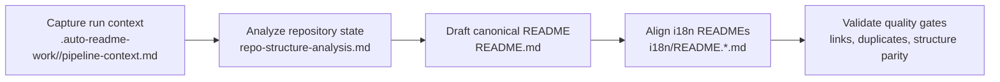

[English](../README.md) · [العربية](README.ar.md) · [Español](README.es.md) · [Français](README.fr.md) · [日本語](README.ja.md) · [한국어](README.ko.md) · [Tiếng Việt](README.vi.md) · [中文 (简体)](README.zh-Hans.md) · [中文（繁體）](README.zh-Hant.md) · [Deutsch](README.de.md) · [Русский](README.ru.md)


<table width="100%"><tr><td width="70%"><a href="https://github.com/lachlanchen/lachlanchen/blob/main/figs/banner.png"></a></td><td width="30%" align="right"><a href="../logos/aginti-logo-wordmark.png"></a></td></tr></table>


# AgInTi

[](https://github.com/lachlanchen/AgInTi)
[](#aginti)
[](#-structure-du-projet)
[](#-périmètre-et-état-actuel)
[](#-licence)
[](#-aperçu)
[](#-fonctionnalités)
[](#-architecture)

Structure de dépôt orientée documentation pour maintenir un README anglais canonique et une documentation multilingue synchronisée, guidée par trois principes opérationnels : **sear creation tools**, **self-healing tools** et **chain of prompt tools**.


## 🧭 Navigation rapide

| Type | Destination |
| --- | --- |
| Résumé du projet | [Aperçu](#-aperçu) |
| Capacités principales | [Fonctionnalités](#-fonctionnalités) |
| Conception du pipeline | [Architecture](#-architecture) |
| Base philosophique | [Philosophie en un coup d’œil](#philosophie-en-un-coup-dœil) |
| Flux contributeur | [Notes de développement](#-notes-de-développement) |
| Direction future | [Feuille de route](#-feuille-de-route) |
| Soutenir le projet | [Support](#-support) |

---

## 📌 Périmètre et état actuel

| Élément | État actuel |
| --- | --- |
| Phase du dépôt | Structure initiale de documentation |
| Code d’exécution | Non détecté dans l’instantané actuel |
| Tests/pipelines CI | Non détectés dans l’instantané actuel |
| Docs localisées | 10 fichiers de locale sous `i18n/` |
| Artefacts du pipeline | Exécutions horodatées sous `.auto-readme-work/` |
| Fichier de licence | Absent en fichier autonome (badge README `TBD`) |
| Base philosophique | Sear creation + self-healing + chain of prompt tools |

## 🌍 Aperçu

AgInTi fonctionne actuellement comme pipeline de cycle de vie du README et de localisation, et non comme application d’exécution. Le `README.md` racine est la source canonique, et les variantes localisées dans `i18n/` sont synchronisées à partir de cette structure canonique.

La philosophie du projet est opérationnelle, pas décorative. Chaque mise à jour du README doit satisfaire les trois principes :

1. **Sear creation tools** : workflows de création volontairement affûtés qui produisent une documentation à fort signal à partir d’indices de dépôt contraints.
2. **Self-healing tools** : mécanismes de réparation qui éliminent dérive, duplication et incohérences structurelles.
3. **Chain of prompt tools** : flux de prompts par étapes et traçables, qui préservent la filiation contexte-vers-sortie entre les exécutions du pipeline.

Ce dépôt préserve un historique utile via des modifications incrémentales, tout en conservant les liens, commandes et métadonnées de support critiques.

### Philosophie en un coup d’œil

| Principe | Intention | Résultat opérationnel |
| --- | --- | --- |
| **Sear creation tools** | Produire une documentation à fort signal depuis des preuves contraintes. | Les sections restent pratiques, spécifiques et ancrées dans le dépôt. |
| **Self-healing tools** | Réparer la dérive, la duplication et les structures obsolètes. | Les README canonique et localisés restent alignés et propres. |
| **Chain of prompt tools** | Garder les étapes de génération explicites et traçables. | Les artefacts du pipeline conservent un contexte et des relais reproductibles. |

## ✨ Fonctionnalités

- Stratégie documentation d’abord avec un document racine canonique.
- Synchronisation multilingue sur 10 variantes README i18n.
- Rédaction pilotée par pipeline via les artefacts `.auto-readme-work/<run-id>/`.
- Invariants « bannière unique » et « panneau de support unique » pour éviter les blocs visuels dupliqués.
- Discipline de mise à jour incrémentale qui préserve l’historique technique substantiel.

### Correspondance principe → fonctionnalité

| Principe central | Manifestation actuelle |
| --- | --- |
| **Sear creation tools** | Rédaction README précise à partir d’indices du dépôt et de gabarits de section stables. |
| **Self-healing tools** | Contrôles de déduplication des blocs bannière/support, des références obsolètes et des dérives de structure. |
| **Chain of prompt tools** | Chaîne d’artefacts propre à chaque exécution (`pipeline-context`, modèles de navigation, plan de traduction) pour une sortie reproductible. |

## 🗂️ Structure du projet

```text
AgInTi/
├── README.md
├── i18n/
│   ├── README.ar.md
│   ├── README.de.md
│   ├── README.es.md
│   ├── README.fr.md
│   ├── README.ja.md
│   ├── README.ko.md
│   ├── README.ru.md
│   ├── README.vi.md
│   ├── README.zh-Hans.md
│   └── README.zh-Hant.md
└── .auto-readme-work/
    ├── 20260228_184104/
    ├── 20260301_064213/
    ├── 20260301_064740/
    ├── 20260301_065835/
    ├── 20260301_070633/
    ├── 20260302_120620/
    ├── 20260302_124338/
    ├── 20260302_140150/
    └── 20260302_140358/
```

## 🏗️ Architecture

À ce stade, l’architecture désigne l’architecture du pipeline de documentation, et non celle d’un service d’exécution.

### Flux du pipeline



### Principes centraux dans l’architecture

- **Sear creation tools** : appliqués pendant la construction du contenu pour garder des sections concrètes, complètes et fidèles au dépôt.
- **Self-healing tools** : appliqués pendant la validation pour supprimer les blocs dupliqués, réparer les références d’exécution obsolètes et restaurer la parité structurelle.
- **Chain of prompt tools** : appliqués sur l’ensemble des artefacts afin que chaque étape de génération reste explicite et auditable.

### Points de contrôle par étape du pipeline

| Étape | Sear creation tools | Self-healing tools | Chain of prompt tools |
| --- | --- | --- | --- |
| Capture du contexte | Définir des contraintes de génération nettes. | Signaler tôt les entrées manquantes ou invalides. | Préserver le prompt source et les métadonnées d’exécution. |
| Rédaction canonique | Construire des sections README complètes à partir des preuves du dépôt. | Éviter les régressions et pertes de contenu accidentelles. | Relier les sorties d’étape aux artefacts précédents. |
| Alignement i18n | Maintenir la parité de structure et de technique entre les locales. | Corriger la dérive entre la racine et les fichiers i18n. | Porter l’intention canonique dans chaque variante localisée. |
| Vérification finale | Imposer lisibilité et préservation du détail. | Supprimer les bannières/panneaux de support en double et les références obsolètes. | Laisser une trace d’artefacts auditable pour l’exécution. |

## 🧾 Entrées de documentation et artefacts générés

| Fichier | Objectif |
| --- | --- |
| `.auto-readme-work/20260302_140358/pipeline-context.md` | Contraintes et objectifs source pour cette passe de génération. |
| `.auto-readme-work/20260302_140358/repo-structure-analysis.md` | Résumé du scan du dépôt et état technique inféré. |
| `.auto-readme-work/20260302_140358/language-nav-root.md` | Ligne canonique d’options de langue pour `README.md` racine. |
| `.auto-readme-work/20260302_140358/language-nav-i18n.md` | Ligne canonique d’options de langue pour les README i18n. |
| `.auto-readme-work/20260302_140358/translation-plan.txt` | Mappage des locales et plan des fichiers i18n cibles. |
| `.auto-readme-work/<older-run-id>/...` | Contexte historique des exécutions précédentes du pipeline. |

## 🔧 Prérequis

- `git`
- Shell POSIX (les exemples utilisent `bash`)
- Éditeur compatible Markdown

### Hypothèses

- Aucun service exécutable ni manifeste d’application n’est présent dans cet instantané du dépôt.
- Les instructions d’installation, de build et de démarrage sont donc orientées workflow documentaire.

## 📥 Installation

Aucun package binaire ni étape de build d’exécution n’est défini pour le moment.

```bash
git clone git@github.com:lachlanchen/AgInTi.git
cd AgInTi
```

## ▶️ Utilisation

L’usage actuel se concentre sur la maintenance documentaire et la synchronisation multilingue.

### Commandes d’inspection courantes

```bash
ls -la
ls -la .auto-readme-work/20260302_140358
ls -la i18n
```

### Workflow de synchronisation du README canonique

1. Lire `.auto-readme-work/20260302_140358/pipeline-context.md`.
2. Vérifier les modèles de sélecteur de langue dans `language-nav-root.md` et `language-nav-i18n.md`.
3. Mettre à jour `README.md` de façon incrémentale comme source de vérité.
4. Aligner les fichiers `i18n/README.*.md` sur la même structure et les mêmes détails techniques clés.
5. Confirmer qu’il y a exactement une bannière et exactement un panneau de support.

## ⚙️ Configuration

Aucune configuration d’exécution n’existe encore. Le comportement documentaire est piloté par les artefacts du dépôt.

- `pipeline-context.md` : objectifs et contraintes d’exécution.
- `repo-structure-analysis.md` : preuves de l’instantané et lacunes.
- `language-nav-root.md` et `language-nav-i18n.md` : cohérence de navigation.
- `translation-plan.txt` : locales cibles et mappage.

## 🧪 Exemples

### Exemple 1 : vérifier les modèles de navigation de langue

```bash
cat .auto-readme-work/20260302_140358/language-nav-root.md
cat .auto-readme-work/20260302_140358/language-nav-i18n.md
```

### Exemple 2 : vérifier le plan de locales

```bash
cat .auto-readme-work/20260302_140358/translation-plan.txt
```

### Exemple 3 : confirmer l’absence de manifeste d’exécution (instantané actuel)

```bash
find . -maxdepth 2 \
  \( -name package.json -o -name pyproject.toml -o -name go.mod -o -name Cargo.toml -o -name pom.xml \)
```

## 🛠️ Notes de développement

- Préserver les sections et liens substantiels de l’historique du README canonique.
- Préférer les modifications incrémentales aux réécritures destructrices.
- Conserver une seule bannière et un seul bloc de support.
- Maintenir la synchronisation des structures README racine et i18n.
- Énoncer clairement les hypothèses quand les détails runtime ou infrastructure sont inconnus.
- Appliquer la triade philosophique comme garde-fous actifs :
  - **Sear creation tools** pour une rédaction à fort signal.
  - **Self-healing tools** pour la réparation de cohérence.
  - **Chain of prompt tools** pour des relais reproductibles entre les étapes du pipeline.

## 🚑 Dépannage

### Je ne vois que des fichiers Markdown et des artefacts de pipeline

C’est attendu dans la phase actuelle d’amorçage.

### Les lignes de sélection de langue diffèrent selon les fichiers

Utilisez les modèles canoniques dans :

- `.auto-readme-work/20260302_140358/language-nav-root.md`
- `.auto-readme-work/20260302_140358/language-nav-i18n.md`

### Ma branche a du retard

```bash
git fetch origin
git pull --ff-only
```

### Je veux ajouter des instructions runtime

Ajoutez des instructions de build et d’exécution uniquement après avoir introduit des manifestes concrets (par exemple : `package.json`, `pyproject.toml`, `go.mod`, `Cargo.toml`) et confirmé leurs chemins dans ce dépôt.

## 🗺️ Feuille de route

1. Renforcer les **sear creation tools** avec des modèles de rédaction README standardisés, des garde-fous de qualité par section et des vérifications plus nettes entre preuve et sortie.
2. Étendre les **self-healing tools** avec des contrôles automatisés des blocs dupliqués, de la dérive des locales, des ancres internes cassées et des références d’exécution obsolètes.
3. Formaliser les **chain of prompt tools** sur les étapes d’exécution pour des traces reproductibles de contexte, génération, traduction et vérification.
4. Ajouter un flux de maintenance documentaire en une seule commande une fois les scripts du dépôt introduits.
5. Ajouter des contrôles CI pour la qualité Markdown, l’intégrité des liens et la parité structurelle i18n.
6. Introduire des composants runtime concrets quand des manifestes sources et points d’entrée seront ajoutés.
7. Publier une décision de licence stable et ajouter un fichier de licence autonome.

### Feuille de route par priorité de principe

| Domaine de focus | Cible à court terme |
| --- | --- |
| **Sear creation tools** | Améliorer les modèles de rédaction et les prompts de section basés sur des preuves. |
| **Self-healing tools** | Automatiser la détection des doublons, les contrôles d’ancres obsolètes et la réparation de dérive des locales. |
| **Chain of prompt tools** | Standardiser les contrats d’artefacts par étape d’exécution pour des sorties multilingues reproductibles. |

## 🤝 Contribution

Les contributions sont les bienvenues.

1. Ouvrez une issue décrivant le changement visé.
2. Créez une branche ciblée.
3. Gardez les modifications documentaires incrémentales et fidèles au dépôt.
4. Préservez les liens importants, les commandes et le contexte historique substantiel.
5. Ouvrez une pull request avec des notes de vérification concises.

### Flux suggéré

```bash
git checkout -b docs/your-update
# edit README.md and/or i18n/README.*.md
git add README.md i18n/README.*.md
git commit -m "docs: refine README content"
git push -u origin docs/your-update
```

## 📄 Licence

TBD. Un fichier de licence autonome est prévu, mais n’est pas encore présent dans l’instantané actuel.


## 🔗 Git Submodules

This repository includes these root submodules:

- [AutoAppDev](https://github.com/lachlanchen/AutoAppDev)
- [AutoNovelWriter](https://github.com/lachlanchen/AutoNovelWriter)
- [OrganoidAgent](https://github.com/lachlanchen/OrganoidAgent)
- [LazyingArtBot](https://github.com/lachlanchen/LazyingArtBot)
- [PaperAgent](https://github.com/lachlanchen/PaperAgent)

## ❤️ Support

| Donate | PayPal | Stripe |
| --- | --- | --- |
| [](https://chat.lazying.art/donate) | [](https://paypal.me/RongzhouChen) | [](https://buy.stripe.com/aFadR8gIaflgfQV6T4fw400) |
