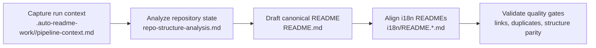

[English](../README.md) · [العربية](README.ar.md) · [Español](README.es.md) · [Français](README.fr.md) · [日本語](README.ja.md) · [한국어](README.ko.md) · [Tiếng Việt](README.vi.md) · [中文 (简体)](README.zh-Hans.md) · [中文（繁體）](README.zh-Hant.md) · [Deutsch](README.de.md) · [Русский](README.ru.md)


[](https://github.com/lachlanchen/lachlanchen/blob/main/figs/banner.png)

# AgInTi

[](https://github.com/lachlanchen/AgInTi)
[](#aginti)
[](#-project-structure)
[](#-scope-and-snapshot)
[](#-license)
[](#-overview)
[](#-features)
[](#-architecture)

英語版 README を正典として維持し、多言語ドキュメントを同期するためのドキュメントファーストなリポジトリ基盤です。運用は **sear creation tools**、**self-healing tools**、**chain of prompt tools** の 3 原則に基づきます。

## 🧭 Quick Navigation

| 種別 | 移動先 |
| --- | --- |
| プロジェクト概要 | [Overview](#-overview) |
| コア機能 | [Features](#-features) |
| パイプライン設計 | [Architecture](#-architecture) |
| 哲学の要点 | [Philosophy at a glance](#philosophy-at-a-glance) |
| 開発ワークフロー | [Development Notes](#-development-notes) |
| 今後の方向性 | [Roadmap](#-roadmap) |
| プロジェクト支援 | [Support](#-support) |

---

## 📌 Scope and Snapshot

| 項目 | 現在の状態 |
| --- | --- |
| リポジトリ段階 | ドキュメント基盤のブートストラップ |
| ランタイムコード | 現在のスナップショットでは未検出 |
| テスト/CI パイプライン | 現在のスナップショットでは未検出 |
| ローカライズ済み文書 | `i18n/` 配下に 10 ロケール |
| パイプライン成果物 | `.auto-readme-work/` 配下のタイムスタンプ付き実行ログ |
| ライセンスファイル | 単独ファイルなし（README バッジは `TBD`） |
| 哲学ベースライン | Sear creation + self-healing + chain of prompt tools |

## 🌍 Overview

AgInTi は現時点で実行アプリケーションではなく、README のライフサイクル管理とローカライズを行うパイプラインとして機能しています。ルートの `README.md` を正典ソースとし、`i18n/` の各言語版はその構造に同期されます。

このプロジェクトの哲学は装飾ではなく運用基準です。README の更新は次の 3 原則すべてを満たすことを前提とします。

1. **Sear creation tools**: 制約のあるリポジトリ証拠から、高密度なドキュメントを意図的に生み出すワークフロー。
2. **Self-healing tools**: ドリフト、重複、構造不整合を修復するメカニズム。
3. **Chain of prompt tools**: パイプライン全体で、コンテキストから出力までの系譜を追跡可能に保つ段階的フロー。

このリポジトリは、重要なリンク・コマンド・サポート情報を保持しながら、意味のある履歴をインクリメンタルに継承します。

### Philosophy at a glance

| Principle | Intent | Operational outcome |
| --- | --- | --- |
| **Sear creation tools** | 制約のある証拠から高密度ドキュメントを生成する。 | セクションが実務的かつ具体的で、リポジトリ根拠に沿った内容になる。 |
| **Self-healing tools** | ドリフト、重複、古い構造を修復する。 | 正典 README と多言語 README の整合性と品質を維持できる。 |
| **Chain of prompt tools** | 生成段階を明示し、追跡可能にする。 | パイプライン成果物に再現可能な文脈と受け渡しが残る。 |

## ✨ Features

- ルート文書を正典とする README ファースト戦略。
- 10 ロケールの i18n README を同期する多言語運用。
- `.auto-readme-work/<run-id>/` 成果物に基づくパイプライン駆動の更新。
- バナーとサポートパネルを単一化する不変条件による重複防止。
- 技術的な履歴を保護するインクリメンタル更新方針。

### Principle-to-feature mapping

| Core principle | Current manifestation |
| --- | --- |
| **Sear creation tools** | リポジトリ証拠に基づく精密な README 作成と、安定したセクション骨格。 |
| **Self-healing tools** | バナー/サポート重複、古い参照、構造ドリフトを対象とした修復チェック。 |
| **Chain of prompt tools** | 実行単位の成果物チェーン（`pipeline-context`、ナビテンプレート、翻訳計画）による再現性確保。 |

## 🗂️ Project Structure

```text
AgInTi/
├── README.md
├── i18n/
│   ├── README.ar.md
│   ├── README.de.md
│   ├── README.es.md
│   ├── README.fr.md
│   ├── README.ja.md
│   ├── README.ko.md
│   ├── README.ru.md
│   ├── README.vi.md
│   ├── README.zh-Hans.md
│   └── README.zh-Hant.md
└── .auto-readme-work/
    ├── 20260228_184104/
    ├── 20260301_064213/
    ├── 20260301_064740/
    ├── 20260301_065835/
    ├── 20260301_070633/
    ├── 20260302_120620/
    ├── 20260302_124338/
    ├── 20260302_140150/
    └── 20260302_140358/
```

## 🏗️ Architecture

現段階での「アーキテクチャ」は、ランタイムサービスではなくドキュメントパイプライン設計を指します。

### Pipeline flow



### Core principles in architecture

- **Sear creation tools**: セクションを具体的かつ完全にし、リポジトリ実態に沿わせるためにコンテンツ作成段階で適用します。
- **Self-healing tools**: 重複ブロックの除去、古い実行参照の修復、構造整合の回復のために検証段階で適用します。
- **Chain of prompt tools**: 各生成段階を明示し監査可能にするために成果物チェーン全体へ適用します。

### Principle checkpoints by pipeline stage

| Stage | Sear creation tools | Self-healing tools | Chain of prompt tools |
| --- | --- | --- | --- |
| Context capture | 鋭い生成制約を定義する。 | 不足・不正な入力を早期に検知する。 | 元プロンプトと実行メタデータを保持する。 |
| Canonical drafting | リポジトリ証拠から完全な README セクションを構築する。 | リグレッションや内容欠落を防ぐ。 | 出力を前段成果物へ結び付ける。 |
| i18n alignment | 各ロケールで構造と技術的同等性を維持する。 | ルートと i18n のドリフトを修正する。 | 正典意図を各翻訳版へ引き継ぐ。 |
| Final verification | 可読性と詳細保持を担保する。 | バナー/サポート重複と古い参照を除去する。 | 実行ごとの監査可能な成果物履歴を残す。 |

## 🧾 Documentation Inputs and Generated Artifacts

| File | Purpose |
| --- | --- |
| `.auto-readme-work/20260302_140358/pipeline-context.md` | この生成実行の制約と目標。 |
| `.auto-readme-work/20260302_140358/repo-structure-analysis.md` | リポジトリ走査サマリーと推定される技術状態。 |
| `.auto-readme-work/20260302_140358/language-nav-root.md` | ルート `README.md` 用の言語選択行テンプレート。 |
| `.auto-readme-work/20260302_140358/language-nav-i18n.md` | i18n README 用の言語選択行テンプレート。 |
| `.auto-readme-work/20260302_140358/translation-plan.txt` | ロケール対応と i18n 対象ファイル計画。 |
| `.auto-readme-work/<older-run-id>/...` | 過去実行からの履歴コンテキスト。 |

## 🔧 Prerequisites

- `git`
- POSIX shell (examples use `bash`)
- Markdown-capable editor

### Assumptions

- このリポジトリの現スナップショットには、実行可能サービスやアプリのマニフェストがありません。
- そのため、インストール・ビルド・起動の説明はドキュメント運用中心になります。

## 📥 Installation

現時点ではバイナリ配布やランタイムビルド手順は定義されていません。

```bash
git clone git@github.com:lachlanchen/AgInTi.git
cd AgInTi
```

## ▶️ Usage

現在の主用途は、ドキュメント保守と多言語同期です。

### Common inspection commands

```bash
ls -la
ls -la .auto-readme-work/20260302_140358
ls -la i18n
```

### Canonical README synchronization workflow

1. `.auto-readme-work/20260302_140358/pipeline-context.md` を読む。
2. `language-nav-root.md` と `language-nav-i18n.md` の言語セレクターテンプレートを確認する。
3. `README.md` を正典ソースとしてインクリメンタルに更新する。
4. `i18n/README.*.md` を同一構造と主要技術情報に合わせて同期する。
5. バナーが 1 つ、サポートパネルが 1 つだけであることを確認する。

## ⚙️ Configuration

現時点でランタイム設定はありません。ドキュメントの振る舞いはリポジトリ成果物で定義されます。

- `pipeline-context.md`: 実行目標と制約
- `repo-structure-analysis.md`: スナップショット証拠と不足情報
- `language-nav-root.md` and `language-nav-i18n.md`: ナビゲーション整合
- `translation-plan.txt`: ロケール対象と対応表

## 🧪 Examples

### Example 1: Verify language navigation templates

```bash
cat .auto-readme-work/20260302_140358/language-nav-root.md
cat .auto-readme-work/20260302_140358/language-nav-i18n.md
```

### Example 2: Check locale plan

```bash
cat .auto-readme-work/20260302_140358/translation-plan.txt
```

### Example 3: Confirm runtime-manifest absence (current snapshot)

```bash
find . -maxdepth 2 \
  \( -name package.json -o -name pyproject.toml -o -name go.mod -o -name Cargo.toml -o -name pom.xml \)
```

## 🛠️ Development Notes

- 正典 README の重要セクションとリンクを保持する。
- 破壊的な全面書き換えではなく、インクリメンタル編集を優先する。
- バナーとサポートブロックはそれぞれ 1 つだけ維持する。
- ルート README と i18n README の構造を同期する。
- ランタイムやインフラ詳細が不明な場合は前提を明示する。
- 哲学トライアドを実運用のガードレールとして適用する。
  - **Sear creation tools**: 高密度な草案作成
  - **Self-healing tools**: 整合性の修復
  - **Chain of prompt tools**: 段階間の再現可能な受け渡し

## 🚑 Troubleshooting

### I only see Markdown files and pipeline artifacts

現在のブートストラップ段階では想定どおりです。

### Language selector lines differ between files

次の正典テンプレートを使用してください。

- `.auto-readme-work/20260302_140358/language-nav-root.md`
- `.auto-readme-work/20260302_140358/language-nav-i18n.md`

### My branch is behind

```bash
git fetch origin
git pull --ff-only
```

### I want to add runtime instructions

`package.json`、`pyproject.toml`、`go.mod`、`Cargo.toml` のような具体的マニフェストを追加し、実際のパスを確認してからビルド/実行手順を追加してください。

## 🗺️ Roadmap

1. **sear creation tools** を強化し、README 作成テンプレート、セクション品質ゲート、証拠に基づく出力検証を標準化する。
2. **self-healing tools** を拡張し、重複ブロック、ロケールドリフト、壊れた内部アンカー、古い実行参照の自動検査を導入する。
3. **chain of prompt tools** を実行段階全体で形式化し、コンテキスト・生成・翻訳・検証の再現可能トレースを確立する。
4. リポジトリスクリプト導入後、ドキュメント保守を単一コマンドで実行可能にする。
5. Markdown 品質、リンク整合、i18n 構造同等性の CI チェックを追加する。
6. ソースマニフェストとエントリーポイント追加後に、具体的なランタイム構成要素を導入する。
7. 安定したライセンス方針を公開し、単独のライセンスファイルを追加する。

### Roadmap by principle focus

| Focus area | Near-term target |
| --- | --- |
| **Sear creation tools** | README 草案テンプレートと、証拠に基づくセクションプロンプトを改善する。 |
| **Self-healing tools** | 重複検出、古いアンカー検査、ロケールドリフト修復を自動化する。 |
| **Chain of prompt tools** | 多言語出力を再現可能にするため、実行段階の成果物契約を標準化する。 |

## 🤝 Contribution

コントリビューションを歓迎します。

1. 変更意図を説明する issue を作成する。
2. 目的を絞ったブランチを作成する。
3. ドキュメント編集はインクリメンタルに行い、リポジトリ実態との整合を保つ。
4. 重要なリンク、コマンド、履歴上の実質的文脈を保持する。
5. 簡潔な検証メモを添えて pull request を作成する。

### Suggested flow

```bash
git checkout -b docs/your-update
# edit README.md and/or i18n/README.*.md
git add README.md i18n/README.*.md
git commit -m "docs: refine README content"
git push -u origin docs/your-update
```

## ❤️ Support

| Donate | PayPal | Stripe |
| --- | --- | --- |
| [](https://chat.lazying.art/donate) | [](https://paypal.me/RongzhouChen) | [](https://buy.stripe.com/aFadR8gIaflgfQV6T4fw400) |

## 📄 License

TBD. 単独のライセンスファイルは計画されていますが、現在のスナップショットにはまだ存在しません。
