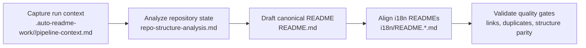

[English](../README.md) · [العربية](README.ar.md) · [Español](README.es.md) · [Français](README.fr.md) · [日本語](README.ja.md) · [한국어](README.ko.md) · [Tiếng Việt](README.vi.md) · [中文 (简体)](README.zh-Hans.md) · [中文（繁體）](README.zh-Hant.md) · [Deutsch](README.de.md) · [Русский](README.ru.md)


[](../logos/aginti-logo-wordmark.png)

# AgInTi

[](https://github.com/lachlanchen/AgInTi)
[](#aginti)
[](#-project-structure)
[](#-scope-and-snapshot)
[](#-license)
[](#-overview)
[](#-features)
[](#-architecture)

하나의 정본 영어 README를 기준으로 다국어 문서를 동기화해 유지하기 위한 문서 우선 저장소 스캐폴드입니다. 이 프로젝트는 세 가지 운영 원칙인 **sear creation tools**, **self-healing tools**, **chain of prompt tools**를 중심으로 설계되었습니다.

## 🧭 Quick Navigation

| 유형 | 이동 대상 |
| --- | --- |
| 프로젝트 요약 | [Overview](#-overview) |
| 핵심 역량 | [Features](#-features) |
| 파이프라인 설계 | [Architecture](#-architecture) |
| 철학 요약 | [Philosophy at a glance](#philosophy-at-a-glance) |
| 기여자 워크플로 | [Development Notes](#-development-notes) |
| 향후 방향 | [Roadmap](#-roadmap) |
| 프로젝트 후원 | [Support](#-support) |

---

## 📌 Scope and Snapshot

| 항목 | 현재 상태 |
| --- | --- |
| 저장소 단계 | 문서 부트스트랩 스캐폴드 |
| 런타임 코드 | 현재 스냅샷에서 확인되지 않음 |
| 테스트/CI 파이프라인 | 현재 스냅샷에서 확인되지 않음 |
| 로컬라이즈 문서 | `i18n/` 아래 10개 로케일 파일 |
| 파이프라인 산출물 | `.auto-readme-work/` 아래 타임스탬프 실행 기록 |
| 라이선스 파일 | 별도 파일 없음 (README 배지에 `TBD` 표시) |
| 철학 기준선 | Sear creation + self-healing + chain of prompt tools |

## 🌍 Overview

AgInTi는 현재 런타임 애플리케이션이 아니라 README 수명주기 및 현지화 파이프라인으로 동작합니다. 루트의 `README.md`가 정본이며, `i18n/`의 로컬라이즈 버전은 이 정본 구조에 맞춰 동기화됩니다.

이 프로젝트의 철학은 장식이 아니라 운영 원칙입니다. README를 업데이트할 때는 아래 세 원칙을 모두 충족해야 합니다.

1. **Sear creation tools**: 제한된 저장소 근거를 바탕으로, 신호 밀도가 높은 문서를 의도적으로 정교한 작성 흐름으로 생성합니다.
2. **Self-healing tools**: 드리프트, 중복, 구조 불일치를 복구 중심으로 제거합니다.
3. **Chain of prompt tools**: 파이프라인 실행 전반에서 컨텍스트-출력 계보를 보존할 수 있도록 단계별·추적 가능한 프롬프트 흐름을 유지합니다.

이 저장소는 점진적 편집을 통해 의미 있는 이력을 유지하면서도, 중요한 링크·명령어·후원 메타데이터를 보존합니다.

### Philosophy at a glance

| 원칙 | 의도 | 운영 결과 |
| --- | --- | --- |
| **Sear creation tools** | 제한된 근거에서 신호 밀도가 높은 문서를 생산합니다. | 각 섹션이 실용적이고 구체적이며 저장소 근거를 유지합니다. |
| **Self-healing tools** | 드리프트, 중복, 오래된 구조를 복구합니다. | 정본 README와 다국어 README가 정렬되고 깔끔하게 유지됩니다. |
| **Chain of prompt tools** | 생성 단계를 명시적이고 추적 가능하게 유지합니다. | 파이프라인 산출물에 재현 가능한 컨텍스트와 인수인계가 남습니다. |

## ✨ Features

- 루트 문서를 정본으로 두는 README 중심 문서 전략
- 10개 i18n README 변형 간 다국어 동기화
- `.auto-readme-work/<run-id>/` 산출물 기반 파이프라인 작성
- 배너 1개·지원 패널 1개 불변식을 통한 시각 블록 중복 방지
- 핵심 기술 이력을 보존하는 점진 업데이트 원칙

### Principle-to-feature mapping

| 핵심 원칙 | 현재 구현 형태 |
| --- | --- |
| **Sear creation tools** | 저장소 근거에 기반한 정밀 README 작성과 안정적인 섹션 스캐폴드 |
| **Self-healing tools** | 중복 배너/지원 블록, 오래된 참조, 구조 드리프트를 위한 중복 제거 점검 |
| **Chain of prompt tools** | 재현 가능한 결과를 위한 실행별 산출물 체인(`pipeline-context`, 내비 템플릿, 번역 계획) |

## 🗂️ Project Structure

```text
AgInTi/
├── README.md
├── i18n/
│   ├── README.ar.md
│   ├── README.de.md
│   ├── README.es.md
│   ├── README.fr.md
│   ├── README.ja.md
│   ├── README.ko.md
│   ├── README.ru.md
│   ├── README.vi.md
│   ├── README.zh-Hans.md
│   └── README.zh-Hant.md
└── .auto-readme-work/
    ├── 20260228_184104/
    ├── 20260301_064213/
    ├── 20260301_064740/
    ├── 20260301_065835/
    ├── 20260301_070633/
    ├── 20260302_120620/
    ├── 20260302_124338/
    ├── 20260302_140150/
    └── 20260302_140358/
```

## 🏗️ Architecture

현재 단계에서의 아키텍처는 런타임 서비스 아키텍처가 아니라 문서 파이프라인 아키텍처를 의미합니다.

### Pipeline flow



### Core principles in architecture

- **Sear creation tools**: 섹션을 구체적이고 완결되며 저장소 사실에 맞게 유지하기 위해 콘텐츠 작성 단계에 적용됩니다.
- **Self-healing tools**: 중복 블록 제거, 오래된 실행 참조 복구, 구조 동등성 회복을 위해 검증 단계에 적용됩니다.
- **Chain of prompt tools**: 생성 산출물 전반에 적용되어 각 단계가 명시 가능하고 감사 가능하도록 유지됩니다.

### Principle checkpoints by pipeline stage

| 단계 | Sear creation tools | Self-healing tools | Chain of prompt tools |
| --- | --- | --- | --- |
| 컨텍스트 수집 | 정교한 생성 제약을 정의합니다. | 누락되거나 잘못된 입력을 초기에 탐지합니다. | 원본 프롬프트와 실행 메타데이터를 보존합니다. |
| 정본 작성 | 저장소 근거로 완전한 README 섹션을 구성합니다. | 회귀와 의도치 않은 콘텐츠 손실을 방지합니다. | 단계 산출물이 이전 산출물과 연결되도록 유지합니다. |
| i18n 정렬 | 로케일 전반의 구조 및 기술 동등성을 유지합니다. | 루트와 i18n 파일 간 드리프트를 교정합니다. | 정본 의도를 각 로컬라이즈 버전에 전달합니다. |
| 최종 검증 | 가독성과 세부 정보 보존을 강제합니다. | 중복 배너/지원 블록 및 오래된 참조를 제거합니다. | 실행별 감사 가능한 산출물 추적을 남깁니다. |

## 🧾 Documentation Inputs and Generated Artifacts

| 파일 | 목적 |
| --- | --- |
| `.auto-readme-work/20260302_140358/pipeline-context.md` | 이번 생성 패스의 입력 제약과 목표 |
| `.auto-readme-work/20260302_140358/repo-structure-analysis.md` | 저장소 스캔 요약과 추론된 기술 상태 |
| `.auto-readme-work/20260302_140358/language-nav-root.md` | 루트 `README.md`용 정본 언어 옵션 라인 |
| `.auto-readme-work/20260302_140358/language-nav-i18n.md` | i18n README용 정본 언어 옵션 라인 |
| `.auto-readme-work/20260302_140358/translation-plan.txt` | 로케일 매핑 및 i18n 대상 파일 계획 |
| `.auto-readme-work/<older-run-id>/...` | 이전 파이프라인 실행에서 남은 이력 컨텍스트 |

## 🔧 Prerequisites

- `git`
- POSIX shell (examples use `bash`)
- Markdown-capable editor

### Assumptions

- 현재 저장소 스냅샷에는 실행 가능한 서비스나 애플리케이션 매니페스트가 없습니다.
- 따라서 설치, 빌드, 시작 가이드는 문서 워크플로 중심으로 제공됩니다.

## 📥 Installation

아직 바이너리 패키지나 런타임 빌드 단계는 정의되어 있지 않습니다.

```bash
git clone git@github.com:lachlanchen/AgInTi.git
cd AgInTi
```

## ▶️ Usage

현재 사용 범위는 문서 유지보수와 다국어 동기화에 집중됩니다.

### Common inspection commands

```bash
ls -la
ls -la .auto-readme-work/20260302_140358
ls -la i18n
```

### Canonical README synchronization workflow

1. `.auto-readme-work/20260302_140358/pipeline-context.md`를 읽습니다.
2. `language-nav-root.md`와 `language-nav-i18n.md`의 언어 선택 템플릿을 검증합니다.
3. 단일 진실 공급원(source of truth)인 `README.md`를 점진적으로 업데이트합니다.
4. `i18n/README.*.md` 파일을 동일한 구조와 핵심 기술 세부에 맞춰 정렬합니다.
5. 배너가 정확히 1개이고 지원 패널도 정확히 1개인지 확인합니다.

## ⚙️ Configuration

아직 런타임 설정은 없습니다. 문서 동작은 저장소 산출물에 의해 구동됩니다.

- `pipeline-context.md`: 실행 목표와 제약
- `repo-structure-analysis.md`: 스냅샷 근거와 공백
- `language-nav-root.md` and `language-nav-i18n.md`: 내비게이션 일관성
- `translation-plan.txt`: 로케일 대상과 매핑

## 🧪 Examples

### Example 1: Verify language navigation templates

```bash
cat .auto-readme-work/20260302_140358/language-nav-root.md
cat .auto-readme-work/20260302_140358/language-nav-i18n.md
```

### Example 2: Check locale plan

```bash
cat .auto-readme-work/20260302_140358/translation-plan.txt
```

### Example 3: Confirm runtime-manifest absence (current snapshot)

```bash
find . -maxdepth 2 \
  \( -name package.json -o -name pyproject.toml -o -name go.mod -o -name Cargo.toml -o -name pom.xml \)
```

## 🛠️ Development Notes

- 정본 README 이력에서 핵심 섹션과 링크를 보존합니다.
- 파괴적 재작성보다 점진적 편집을 우선합니다.
- 배너와 지원 블록은 각각 하나만 유지합니다.
- 루트와 i18n README 구조를 동기화 상태로 유지합니다.
- 런타임/인프라 세부가 불명확하면 가정을 명확히 적습니다.
- 철학 3요소를 실제 가드레일로 적용합니다.
  - 고신호 초안을 위한 **Sear creation tools**
  - 일관성 복구를 위한 **Self-healing tools**
  - 파이프라인 단계 간 재현 가능한 인수인계를 위한 **Chain of prompt tools**

## 🚑 Troubleshooting

### I only see Markdown files and pipeline artifacts

현재 부트스트랩 단계에서는 정상적인 상태입니다.

### Language selector lines differ between files

아래의 정본 템플릿을 사용하세요.

- `.auto-readme-work/20260302_140358/language-nav-root.md`
- `.auto-readme-work/20260302_140358/language-nav-i18n.md`

### My branch is behind

```bash
git fetch origin
git pull --ff-only
```

### I want to add runtime instructions

구체적인 매니페스트(예: `package.json`, `pyproject.toml`, `go.mod`, `Cargo.toml`)를 추가하고, 이 저장소 내 경로를 확인한 뒤에만 빌드/실행 지침을 추가하세요.

## 🗺️ Roadmap

1. 표준 README 작성 템플릿, 섹션 품질 게이트, 더 명확한 근거-결과 점검을 통해 **sear creation tools**를 강화합니다.
2. 중복 블록, 로케일 드리프트, 깨진 내부 앵커, 오래된 실행 참조를 자동 점검하도록 **self-healing tools**를 확장합니다.
3. 재현 가능한 컨텍스트·생성·번역·검증 추적을 위해 실행 단계 전반에 **chain of prompt tools**를 공식화합니다.
4. 저장소 스크립트가 도입되면 단일 명령 문서 유지보수 흐름을 추가합니다.
5. 마크다운 품질, 링크 무결성, i18n 구조 동등성에 대한 CI 점검을 추가합니다.
6. 소스 매니페스트와 엔트리포인트가 추가되면 구체적인 런타임 구성요소를 도입합니다.
7. 안정적인 라이선스 결정을 공개하고 별도 라이선스 파일을 추가합니다.

### Roadmap by principle focus

| Focus area | Near-term target |
| --- | --- |
| **Sear creation tools** | 초안 템플릿과 근거 기반 섹션 프롬프트를 개선합니다. |
| **Self-healing tools** | 중복 탐지, 오래된 앵커 점검, 로케일 드리프트 복구를 자동화합니다. |
| **Chain of prompt tools** | 재현 가능한 다국어 출력을 위해 실행 단계 산출물 계약을 표준화합니다. |

## 🤝 Contribution

기여를 환영합니다.

1. 의도한 변경 사항을 설명하는 이슈를 등록합니다.
2. 범위가 명확한 브랜치를 생성합니다.
3. 문서 수정은 점진적으로 진행하고 저장소 사실과 맞게 유지합니다.
4. 중요한 링크, 명령어, 핵심 이력 맥락을 보존합니다.
5. 간결한 검증 노트와 함께 Pull Request를 엽니다.

### Suggested flow

```bash
git checkout -b docs/your-update
# edit README.md and/or i18n/README.*.md
git add README.md i18n/README.*.md
git commit -m "docs: refine README content"
git push -u origin docs/your-update
```

## 🔗 Git Submodules

This repository includes these root submodules:

- [AutoAppDev](https://github.com/lachlanchen/AutoAppDev)
- [AutoNovelWriter](https://github.com/lachlanchen/AutoNovelWriter)
- [OrganoidAgent](https://github.com/lachlanchen/OrganoidAgent)
- [LazyingArtBot](https://github.com/lachlanchen/LazyingArtBot)
- [PaperAgent](https://github.com/lachlanchen/PaperAgent)

## ❤️ Support

| Donate | PayPal | Stripe |
| --- | --- | --- |
| [](https://chat.lazying.art/donate) | [](https://paypal.me/RongzhouChen) | [](https://buy.stripe.com/aFadR8gIaflgfQV6T4fw400) |

## 📄 License

TBD. 별도의 라이선스 파일은 계획되어 있지만 현재 스냅샷에는 아직 없습니다.
