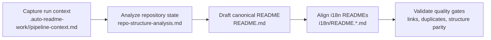

[English](../README.md) · [العربية](README.ar.md) · [Español](README.es.md) · [Français](README.fr.md) · [日本語](README.ja.md) · [한국어](README.ko.md) · [Tiếng Việt](README.vi.md) · [中文 (简体)](README.zh-Hans.md) · [中文（繁體）](README.zh-Hant.md) · [Deutsch](README.de.md) · [Русский](README.ru.md)


[](https://github.com/lachlanchen/lachlanchen/blob/main/figs/banner.png)

# AgInTi

[](https://github.com/lachlanchen/AgInTi)
[](#aginti)
[](#-структура-проекта)
[](#-область-охвата-и-снимок-состояния)
[](#-лицензия)
[](#-обзор)
[](#-возможности)
[](#-архитектура)

Репозиторий в формате documentation-first для поддержки одного канонического README на английском и синхронизированной многоязычной документации. Основан на трех рабочих принципах: **инструменты sear creation**, **инструменты self-healing** и **цепочка инструментов prompt**.

## 🧭 Быстрая навигация

| Тип | Раздел |
| --- | --- |
| Кратко о проекте | [Обзор](#-обзор) |
| Ключевые возможности | [Возможности](#-возможности) |
| Схема пайплайна | [Архитектура](#-архитектура) |
| Базовая философия | [Философия в двух словах](#философия-в-двух-словах) |
| Рабочий процесс контрибьюторов | [Заметки по разработке](#-заметки-по-разработке) |
| Дальнейшее развитие | [Дорожная карта](#-дорожная-карта) |
| Поддержка проекта | [Support](#-support) |

---

## 📌 Область охвата и снимок состояния

| Пункт | Текущее состояние |
| --- | --- |
| Этап репозитория | Базовый каркас документации |
| Исполняемый код | Не обнаружен в текущем снимке |
| Тесты/CI-пайплайны | Не обнаружены в текущем снимке |
| Локализованные документы | 10 файлов локализации в `i18n/` |
| Артефакты пайплайна | Запуски с метками времени в `.auto-readme-work/` |
| Файл лицензии | Отсутствует как отдельный файл (в бейдже README указано `TBD`) |
| Базовая философия | Sear creation + self-healing + chain of prompt tools |

## 🌍 Обзор

Сейчас AgInTi работает как пайплайн жизненного цикла README и локализации, а не как runtime-приложение. Корневой `README.md` является каноническим источником, а локализованные версии в `i18n/` синхронизируются с этой структурой.

Философия проекта операционная, а не декоративная. Каждое обновление README должно соответствовать всем трем принципам:

1. **Инструменты sear creation**: намеренно точные процессы создания, генерирующие высокосигнальную документацию из ограниченных данных репозитория.
2. **Инструменты self-healing**: механизмы восстановления, устраняющие дрейф, дублирование и структурную несогласованность.
3. **Цепочка инструментов prompt**: поэтапные и отслеживаемые потоки промптов, сохраняющие связь контекста и результата между запусками пайплайна.

Репозиторий сохраняет значимый исторический контент через инкрементальные правки, одновременно удерживая критичные ссылки, команды и метаданные поддержки.

### Философия в двух словах

| Принцип | Назначение | Практический результат |
| --- | --- | --- |
| **Инструменты sear creation** | Формировать высокосигнальную документацию из ограниченных данных. | Разделы остаются практичными, конкретными и привязанными к репозиторию. |
| **Инструменты self-healing** | Исправлять дрейф, дублирование и устаревшую структуру. | Канонический и локализованные README остаются согласованными и чистыми. |
| **Цепочка инструментов prompt** | Делать этапы генерации явными и прослеживаемыми. | Артефакты пайплайна сохраняют воспроизводимый контекст и передачу между этапами. |

## ✨ Возможности

- Стратегия documentation-first с каноническим корневым документом README.
- Многоязычная синхронизация 10 i18n-вариантов README.
- Подготовка контента через артефакты `.auto-readme-work/<run-id>/`.
- Инварианты «один баннер и один блок поддержки», предотвращающие дубли визуальных блоков.
- Дисциплина инкрементальных обновлений, сохраняющая содержательную техническую историю.

### Соответствие принципов и возможностей

| Базовый принцип | Текущее проявление |
| --- | --- |
| **Инструменты sear creation** | Точная подготовка README на основе данных репозитория и стабильных шаблонов разделов. |
| **Инструменты self-healing** | Проверки на дубли баннера/поддержки, устаревшие ссылки и структурный дрейф. |
| **Цепочка инструментов prompt** | Цепочка артефактов запуска (`pipeline-context`, шаблоны навигации, план перевода) для воспроизводимого результата. |

## 🗂️ Структура проекта

```text
AgInTi/
├── README.md
├── i18n/
│   ├── README.ar.md
│   ├── README.de.md
│   ├── README.es.md
│   ├── README.fr.md
│   ├── README.ja.md
│   ├── README.ko.md
│   ├── README.ru.md
│   ├── README.vi.md
│   ├── README.zh-Hans.md
│   └── README.zh-Hant.md
└── .auto-readme-work/
    ├── 20260228_184104/
    ├── 20260301_064213/
    ├── 20260301_064740/
    ├── 20260301_065835/
    ├── 20260301_070633/
    ├── 20260302_120620/
    ├── 20260302_124338/
    ├── 20260302_140150/
    └── 20260302_140358/
```

## 🏗️ Архитектура

На этом этапе архитектура означает архитектуру документационного пайплайна, а не архитектуру runtime-сервиса.

### Поток пайплайна



### Базовые принципы в архитектуре

- **Инструменты sear creation**: применяются на этапе создания контента, чтобы разделы оставались конкретными, полными и точными относительно репозитория.
- **Инструменты self-healing**: применяются на валидации для удаления дублирующихся блоков, исправления устаревших ссылок на запуски и восстановления структурной согласованности.
- **Цепочка инструментов prompt**: применяется на всем наборе артефактов, чтобы каждый этап генерации оставался явным и проверяемым.

### Контроль принципов по этапам пайплайна

| Этап | Инструменты sear creation | Инструменты self-healing | Цепочка инструментов prompt |
| --- | --- | --- | --- |
| Сбор контекста | Задают четкие ограничения генерации. | Рано выявляют отсутствующие или некорректные входные данные. | Сохраняют исходный промпт и метаданные запуска. |
| Подготовка канонического README | Формируют полноту разделов на базе данных репозитория. | Предотвращают регрессии и случайную потерю контента. | Связывают выход этапа с предыдущими артефактами. |
| Синхронизация i18n | Поддерживают структурную и техническую эквивалентность между локалями. | Исправляют дрейф между корневым и i18n-файлами. | Переносят канонический замысел в каждую локализованную версию. |
| Финальная проверка | Обеспечивает читаемость и сохранность деталей. | Удаляет дубли баннера/поддержки и устаревшие ссылки. | Оставляет проверяемый след артефактов по запуску. |

## 🧾 Входные данные документации и сгенерированные артефакты

| Файл | Назначение |
| --- | --- |
| `.auto-readme-work/20260302_140358/pipeline-context.md` | Исходные ограничения и цели этого прогона генерации. |
| `.auto-readme-work/20260302_140358/repo-structure-analysis.md` | Сводка сканирования репозитория и вывод о техническом состоянии. |
| `.auto-readme-work/20260302_140358/language-nav-root.md` | Каноническая строка выбора языка для корневого `README.md`. |
| `.auto-readme-work/20260302_140358/language-nav-i18n.md` | Каноническая строка выбора языка для i18n README-файлов. |
| `.auto-readme-work/20260302_140358/translation-plan.txt` | Карта локалей и план целевых i18n-файлов. |
| `.auto-readme-work/<older-run-id>/...` | Исторический контекст прошлых запусков пайплайна. |

## 🔧 Предварительные требования

- `git`
- POSIX shell (в примерах используется `bash`)
- Редактор с поддержкой Markdown

### Допущения

- В текущем снимке репозитория отсутствует запускаемый сервис или манифест приложения.
- Поэтому инструкции по установке, сборке и запуску ориентированы на процесс ведения документации.

## 📥 Установка

Пока не определены ни бинарный пакет, ни runtime-этап сборки.

```bash
git clone git@github.com:lachlanchen/AgInTi.git
cd AgInTi
```

## ▶️ Использование

Текущее использование сосредоточено на поддержке документации и многоязычной синхронизации.

### Распространенные команды для проверки

```bash
ls -la
ls -la .auto-readme-work/20260302_140358
ls -la i18n
```

### Рабочий процесс синхронизации канонического README

1. Прочитайте `.auto-readme-work/20260302_140358/pipeline-context.md`.
2. Проверьте шаблоны языкового селектора в `language-nav-root.md` и `language-nav-i18n.md`.
3. Инкрементально обновляйте `README.md` как источник истины.
4. Приведите `i18n/README.*.md` к той же структуре и ключевым техническим деталям.
5. Убедитесь, что есть ровно один баннер и ровно один блок поддержки.

## ⚙️ Конфигурация

Runtime-конфигурация пока отсутствует. Поведение документации определяется артефактами репозитория.

- `pipeline-context.md`: цели и ограничения запуска.
- `repo-structure-analysis.md`: данные снимка и пробелы.
- `language-nav-root.md` и `language-nav-i18n.md`: консистентность навигации.
- `translation-plan.txt`: целевые локали и сопоставления.

## 🧪 Примеры

### Пример 1: Проверка шаблонов языковой навигации

```bash
cat .auto-readme-work/20260302_140358/language-nav-root.md
cat .auto-readme-work/20260302_140358/language-nav-i18n.md
```

### Пример 2: Проверка плана локалей

```bash
cat .auto-readme-work/20260302_140358/translation-plan.txt
```

### Пример 3: Проверка отсутствия runtime-манифестов (текущий снимок)

```bash
find . -maxdepth 2 \
  \( -name package.json -o -name pyproject.toml -o -name go.mod -o -name Cargo.toml -o -name pom.xml \)
```

## 🛠️ Заметки по разработке

- Сохраняйте содержательные разделы и ссылки из истории канонического README.
- Предпочитайте инкрементальные правки вместо деструктивных переписываний.
- Оставляйте только один баннер и только один блок поддержки.
- Поддерживайте синхронизацию структуры между корневым и i18n README.
- Явно указывайте допущения, когда детали runtime или инфраструктуры неизвестны.
- Применяйте триаду философии как рабочие ограничители:
  - **Инструменты sear creation** для высокосигнальной подготовки контента.
  - **Инструменты self-healing** для исправления несогласованности.
  - **Цепочка инструментов prompt** для воспроизводимой передачи между этапами пайплайна.

## 🚑 Устранение неполадок

### Я вижу только Markdown-файлы и артефакты пайплайна

Это ожидаемо для текущего этапа начального каркаса.

### Строки выбора языка отличаются между файлами

Используйте канонические шаблоны в:

- `.auto-readme-work/20260302_140358/language-nav-root.md`
- `.auto-readme-work/20260302_140358/language-nav-i18n.md`

### Моя ветка отстает

```bash
git fetch origin
git pull --ff-only
```

### Я хочу добавить инструкции по runtime

Добавляйте инструкции по сборке и запуску только после появления конкретных манифестов (например: `package.json`, `pyproject.toml`, `go.mod`, `Cargo.toml`) и подтверждения их путей в этом репозитории.

## 🗺️ Дорожная карта

1. Усилить **инструменты sear creation** через стандартизированные шаблоны подготовки README, quality gates для разделов и более четкие проверки «данные -> результат».
2. Расширить **инструменты self-healing** автоматическими проверками дублирующихся блоков, дрейфа локалей, битых внутренних якорей и устаревших ссылок на запуски.
3. Формализовать **цепочку инструментов prompt** между этапами запуска для воспроизводимых трасс контекста, генерации, перевода и проверки.
4. Добавить однокомандный процесс поддержки документации после появления скриптов в репозитории.
5. Добавить CI-проверки качества Markdown, целостности ссылок и структурного паритета i18n.
6. Добавить конкретные runtime-компоненты, когда в репозитории появятся манифесты исходников и точки входа.
7. Принять стабильное решение по лицензии и добавить отдельный файл лицензии.

### Дорожная карта по фокусу принципов

| Область фокуса | Ближайшая цель |
| --- | --- |
| **Инструменты sear creation** | Улучшить шаблоны подготовки и промпты разделов с опорой на факты репозитория. |
| **Инструменты self-healing** | Автоматизировать поиск дублей, проверку устаревших якорей и исправление дрейфа локалей. |
| **Цепочка инструментов prompt** | Стандартизировать контракты артефактов этапов запуска для воспроизводимого многоязычного вывода. |

## 🤝 Участие

Вклад приветствуется.

1. Создайте issue с описанием планируемого изменения.
2. Создайте отдельную целевую ветку.
3. Вносите изменения в документацию инкрементально и с привязкой к фактам репозитория.
4. Сохраняйте важные ссылки, команды и содержательный исторический контекст.
5. Откройте pull request с краткими заметками по проверке.

### Рекомендуемый процесс

```bash
git checkout -b docs/your-update
# edit README.md and/or i18n/README.*.md
git add README.md i18n/README.*.md
git commit -m "docs: refine README content"
git push -u origin docs/your-update
```

## 📄 Лицензия

TBD. Отдельный файл лицензии запланирован, но в текущем снимке еще отсутствует.


## 🔗 Git Submodules

This repository includes these root submodules:

- [AutoAppDev](https://github.com/lachlanchen/AutoAppDev)
- [AutoNovelWriter](https://github.com/lachlanchen/AutoNovelWriter)
- [OrganoidAgent](https://github.com/lachlanchen/OrganoidAgent)
- [LazyingArtBot](https://github.com/lachlanchen/LazyingArtBot)
- [PaperAgent](https://github.com/lachlanchen/PaperAgent)

## ❤️ Support

| Donate | PayPal | Stripe |
| --- | --- | --- |
| [](https://chat.lazying.art/donate) | [](https://paypal.me/RongzhouChen) | [](https://buy.stripe.com/aFadR8gIaflgfQV6T4fw400) |
