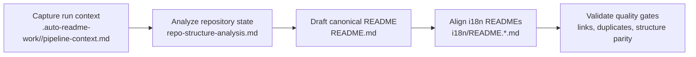

[English](../README.md) · [العربية](README.ar.md) · [Español](README.es.md) · [Français](README.fr.md) · [日本語](README.ja.md) · [한국어](README.ko.md) · [Tiếng Việt](README.vi.md) · [中文 (简体)](README.zh-Hans.md) · [中文（繁體）](README.zh-Hant.md) · [Deutsch](README.de.md) · [Русский](README.ru.md)


<table><tr><td><a href="https://github.com/lachlanchen/lachlanchen/blob/main/figs/banner.png"></a></td><td><a href="../logos/aginti-logo-wordmark.png"></a></td></tr></table>


# AgInTi

[](https://github.com/lachlanchen/AgInTi)
[](#aginti)
[](#-cau-truc-du-an)
[](#-pham-vi-va-anh-chup-hien-trang)
[](#-giay-phep)
[](#-tong-quan)
[](#-tinh-nang)
[](#-kien-truc)

Khung repository theo hướng tài liệu, duy trì một README tiếng Anh chuẩn duy nhất và các tài liệu đa ngôn ngữ được đồng bộ, dựa trên ba nguyên tắc vận hành: **sear creation tools**, **self-healing tools** và **chain of prompt tools**.


## 🧭 Điều hướng nhanh

| Loại | Điểm đến |
| --- | --- |
| Tóm tắt dự án | [Tổng quan](#-tong-quan) |
| Năng lực cốt lõi | [Tính năng](#-tinh-nang) |
| Thiết kế pipeline | [Kiến trúc](#-kien-truc) |
| Nền tảng triết lý | [Triết lý trong một bảng](#triet-ly-trong-mot-bang) |
| Quy trình cộng tác viên | [Ghi chú phát triển](#-ghi-chu-phat-trien) |
| Định hướng tương lai | [Lộ trình](#-lo-trinh) |
| Hỗ trợ dự án | [Support](#-support) |

---

## 📌 Phạm vi và ảnh chụp hiện trạng

| Hạng mục | Trạng thái hiện tại |
| --- | --- |
| Giai đoạn repository | Khung khởi tạo tài liệu |
| Mã runtime | Chưa phát hiện trong ảnh chụp hiện tại |
| Pipeline kiểm thử/CI | Chưa phát hiện trong ảnh chụp hiện tại |
| Tài liệu bản địa hóa | 10 tệp ngôn ngữ trong `i18n/` |
| Tệp sinh từ pipeline | Các lần chạy theo timestamp trong `.auto-readme-work/` |
| Tệp license | Chưa có tệp riêng (badge README hiển thị `TBD`) |
| Nền tảng triết lý | Sear creation + self-healing + chain of prompt tools |

## 🌍 Tổng quan

AgInTi hiện vận hành như một pipeline vòng đời README và bản địa hóa, chưa phải ứng dụng runtime. `README.md` ở thư mục gốc là nguồn chuẩn, và các bản dịch trong `i18n/` được đồng bộ từ cấu trúc chuẩn này.

Triết lý dự án mang tính vận hành, không chỉ để trang trí. Mỗi lần cập nhật README cần đáp ứng đủ cả ba nguyên tắc:

1. **Sear creation tools**: quy trình tạo nội dung có chủ đích và sắc nét, tạo tài liệu tín hiệu cao từ bằng chứng repository có giới hạn.
2. **Self-healing tools**: cơ chế ưu tiên sửa chữa để loại bỏ lệch pha, trùng lặp và bất nhất cấu trúc.
3. **Chain of prompt tools**: luồng prompt theo từng giai đoạn, có thể truy vết, bảo toàn chuỗi ngữ cảnh-đầu ra qua các lần chạy pipeline.

Repository này bảo toàn nội dung lịch sử có giá trị bằng các chỉnh sửa tăng dần, đồng thời giữ nguyên các liên kết quan trọng, lệnh và metadata hỗ trợ.

### Triết lý trong một bảng

| Nguyên tắc | Mục tiêu | Kết quả vận hành |
| --- | --- | --- |
| **Sear creation tools** | Tạo tài liệu tín hiệu cao từ bằng chứng có giới hạn. | Các phần nội dung luôn thực dụng, cụ thể và bám sát repository. |
| **Self-healing tools** | Sửa lệch pha, trùng lặp và cấu trúc lỗi thời. | README chuẩn và README đa ngôn ngữ luôn đồng bộ, gọn sạch. |
| **Chain of prompt tools** | Giữ các giai đoạn sinh nội dung rõ ràng, truy vết được. | Artifacts pipeline bảo toàn bối cảnh và bàn giao có thể tái lập. |

## ✨ Tính năng

- Chiến lược tài liệu ưu tiên README với một tài liệu chuẩn ở thư mục gốc.
- Đồng bộ đa ngôn ngữ trên 10 biến thể README i18n.
- Biên soạn theo pipeline qua các artifact trong `.auto-readme-work/<run-id>/`.
- Bất biến một banner và một khối support để tránh trùng lặp khối hiển thị.
- Kỷ luật cập nhật tăng dần để giữ lại lịch sử kỹ thuật quan trọng.

### Bản đồ nguyên tắc - tính năng

| Nguyên tắc cốt lõi | Biểu hiện hiện tại |
| --- | --- |
| **Sear creation tools** | Soạn README chính xác dựa trên bằng chứng repository và khung mục ổn định. |
| **Self-healing tools** | Kiểm tra loại trùng cho banner/support lặp, tham chiếu cũ và lệch cấu trúc. |
| **Chain of prompt tools** | Chuỗi artifact theo từng lần chạy (`pipeline-context`, mẫu nav, kế hoạch dịch) để tái lập đầu ra. |

## 🗂️ Cấu trúc dự án

```text
AgInTi/
├── README.md
├── i18n/
│   ├── README.ar.md
│   ├── README.de.md
│   ├── README.es.md
│   ├── README.fr.md
│   ├── README.ja.md
│   ├── README.ko.md
│   ├── README.ru.md
│   ├── README.vi.md
│   ├── README.zh-Hans.md
│   └── README.zh-Hant.md
└── .auto-readme-work/
    ├── 20260228_184104/
    ├── 20260301_064213/
    ├── 20260301_064740/
    ├── 20260301_065835/
    ├── 20260301_070633/
    ├── 20260302_120620/
    ├── 20260302_124338/
    ├── 20260302_140150/
    └── 20260302_140358/
```

## 🏗️ Kiến trúc

Ở giai đoạn hiện tại, kiến trúc ở đây là kiến trúc pipeline tài liệu, không phải kiến trúc dịch vụ runtime.

### Luồng pipeline



### Các nguyên tắc cốt lõi trong kiến trúc

- **Sear creation tools**: áp dụng khi xây dựng nội dung để các phần luôn cụ thể, đầy đủ và chính xác theo repository.
- **Self-healing tools**: áp dụng khi kiểm định để xóa khối lặp, sửa tham chiếu run lỗi thời và khôi phục tính đồng nhất cấu trúc.
- **Chain of prompt tools**: áp dụng xuyên suốt artifacts để mỗi giai đoạn sinh nội dung đều rõ ràng và kiểm toán được.

### Điểm kiểm tra nguyên tắc theo từng giai đoạn pipeline

| Giai đoạn | Sear creation tools | Self-healing tools | Chain of prompt tools |
| --- | --- | --- | --- |
| Thu thập ngữ cảnh | Đặt ràng buộc sinh nội dung rõ và sắc. | Cảnh báo sớm đầu vào thiếu hoặc không hợp lệ. | Lưu prompt nguồn và metadata lần chạy. |
| Soạn bản chuẩn | Xây dựng đầy đủ các mục README từ bằng chứng repository. | Ngăn hồi quy và mất mát nội dung ngoài ý muốn. | Giữ đầu ra mỗi giai đoạn nối với artifacts trước đó. |
| Đồng bộ i18n | Duy trì đồng nhất cấu trúc và chi tiết kỹ thuật giữa các ngôn ngữ. | Sửa lệch pha giữa bản gốc và các tệp i18n. | Mang ý định bản chuẩn vào từng bản dịch. |
| Kiểm định cuối | Cưỡng chế độ dễ đọc và giữ đủ chi tiết. | Loại banner/support trùng và tham chiếu cũ. | Để lại vệt artifacts có thể kiểm toán cho lần chạy. |

## 🧾 Đầu vào tài liệu và artifacts được tạo

| Tệp | Mục đích |
| --- | --- |
| `.auto-readme-work/20260302_140358/pipeline-context.md` | Ràng buộc và mục tiêu nguồn cho lần tạo này. |
| `.auto-readme-work/20260302_140358/repo-structure-analysis.md` | Tóm tắt quét repository và trạng thái kỹ thuật suy luận được. |
| `.auto-readme-work/20260302_140358/language-nav-root.md` | Dòng tùy chọn ngôn ngữ chuẩn cho `README.md` gốc. |
| `.auto-readme-work/20260302_140358/language-nav-i18n.md` | Dòng tùy chọn ngôn ngữ chuẩn cho các README i18n. |
| `.auto-readme-work/20260302_140358/translation-plan.txt` | Ánh xạ locale và kế hoạch tệp đích i18n. |
| `.auto-readme-work/<older-run-id>/...` | Ngữ cảnh lịch sử từ các lần chạy trước. |

## 🔧 Điều kiện tiên quyết

- `git`
- POSIX shell (ví dụ dùng `bash`)
- Trình soạn thảo hỗ trợ Markdown

### Giả định

- Không có dịch vụ chạy được hoặc manifest ứng dụng trong ảnh chụp repository hiện tại.
- Vì vậy, hướng dẫn cài đặt, build và chạy hiện tập trung vào quy trình tài liệu.

## 📥 Cài đặt

Hiện chưa có gói nhị phân hoặc bước build runtime nào được định nghĩa.

```bash
git clone git@github.com:lachlanchen/AgInTi.git
cd AgInTi
```

## ▶️ Cách dùng

Cách dùng hiện tại tập trung vào bảo trì tài liệu và đồng bộ đa ngôn ngữ.

### Các lệnh kiểm tra thường dùng

```bash
ls -la
ls -la .auto-readme-work/20260302_140358
ls -la i18n
```

### Quy trình đồng bộ README chuẩn

1. Đọc `.auto-readme-work/20260302_140358/pipeline-context.md`.
2. Xác minh mẫu bộ chọn ngôn ngữ trong `language-nav-root.md` và `language-nav-i18n.md`.
3. Cập nhật `README.md` theo hướng tăng dần như nguồn chuẩn.
4. Đồng bộ `i18n/README.*.md` theo cùng cấu trúc và các chi tiết kỹ thuật chính.
5. Xác nhận chỉ có đúng một banner và đúng một khối support.

## ⚙️ Cấu hình

Hiện chưa có cấu hình runtime. Hành vi tài liệu được điều khiển bởi các artifact trong repository.

- `pipeline-context.md`: mục tiêu và ràng buộc lần chạy.
- `repo-structure-analysis.md`: bằng chứng snapshot và khoảng trống.
- `language-nav-root.md` và `language-nav-i18n.md`: tính nhất quán điều hướng.
- `translation-plan.txt`: locale đích và ánh xạ.

## 🧪 Ví dụ

### Ví dụ 1: Kiểm tra mẫu điều hướng ngôn ngữ

```bash
cat .auto-readme-work/20260302_140358/language-nav-root.md
cat .auto-readme-work/20260302_140358/language-nav-i18n.md
```

### Ví dụ 2: Kiểm tra kế hoạch locale

```bash
cat .auto-readme-work/20260302_140358/translation-plan.txt
```

### Ví dụ 3: Xác nhận không có runtime manifest (snapshot hiện tại)

```bash
find . -maxdepth 2 \
  \( -name package.json -o -name pyproject.toml -o -name go.mod -o -name Cargo.toml -o -name pom.xml \)
```

## 🛠️ Ghi chú phát triển

- Giữ nguyên các mục và liên kết quan trọng từ lịch sử README chuẩn.
- Ưu tiên chỉnh sửa tăng dần thay vì viết lại phá hủy.
- Chỉ giữ một banner và một khối support.
- Giữ cấu trúc README gốc và i18n đồng bộ.
- Nêu rõ giả định mỗi khi chưa có đủ chi tiết runtime hoặc hạ tầng.
- Áp dụng bộ ba triết lý như các chốt chặn vận hành chủ động:
  - **Sear creation tools** để soạn nội dung tín hiệu cao.
  - **Self-healing tools** để sửa tính nhất quán.
  - **Chain of prompt tools** để bàn giao tái lập giữa các giai đoạn pipeline.

## 🚑 Khắc phục sự cố

### Tôi chỉ thấy tệp Markdown và artifact pipeline

Điều này đúng với giai đoạn bootstrap hiện tại.

### Dòng bộ chọn ngôn ngữ khác nhau giữa các tệp

Hãy dùng các mẫu chuẩn tại:

- `.auto-readme-work/20260302_140358/language-nav-root.md`
- `.auto-readme-work/20260302_140358/language-nav-i18n.md`

### Nhánh của tôi đang bị tụt phía sau

```bash
git fetch origin
git pull --ff-only
```

### Tôi muốn thêm hướng dẫn runtime

Chỉ thêm hướng dẫn build/chạy sau khi đã có manifest cụ thể (ví dụ: `package.json`, `pyproject.toml`, `go.mod`, `Cargo.toml`) và xác nhận đúng đường dẫn của chúng trong repository.

## 🗺️ Lộ trình

1. Tăng cường **sear creation tools** bằng mẫu soạn README chuẩn hóa, quality gate cho từng mục và kiểm tra bằng chứng-đầu ra rõ ràng hơn.
2. Mở rộng **self-healing tools** với kiểm tra tự động cho khối trùng lặp, lệch locale, anchor nội bộ hỏng và tham chiếu run lỗi thời.
3. Chuẩn hóa **chain of prompt tools** theo từng giai đoạn để truy vết ngữ cảnh, tạo nội dung, dịch và kiểm định một cách tái lập.
4. Bổ sung luồng bảo trì tài liệu bằng một lệnh duy nhất khi các script của repository được đưa vào.
5. Bổ sung kiểm tra CI cho chất lượng markdown, tính toàn vẹn liên kết và tính đồng dạng cấu trúc i18n.
6. Giới thiệu các thành phần runtime cụ thể khi thêm manifests nguồn và entrypoints.
7. Công bố quyết định license ổn định và thêm tệp license độc lập.

### Lộ trình theo trọng tâm nguyên tắc

| Trọng tâm | Mục tiêu gần hạn |
| --- | --- |
| **Sear creation tools** | Cải thiện mẫu soạn thảo và prompt mục dựa trên bằng chứng. |
| **Self-healing tools** | Tự động hóa phát hiện trùng lặp, kiểm tra anchor cũ và sửa lệch locale. |
| **Chain of prompt tools** | Chuẩn hóa hợp đồng artifacts theo từng giai đoạn để tạo đầu ra đa ngôn ngữ có thể tái lập. |

## 🤝 Đóng góp

Hoan nghênh mọi đóng góp.

1. Mở issue mô tả thay đổi dự kiến.
2. Tạo một nhánh tập trung cho thay đổi đó.
3. Giữ chỉnh sửa tài liệu theo hướng tăng dần và chính xác theo repository.
4. Bảo toàn các liên kết, lệnh và bối cảnh lịch sử quan trọng.
5. Mở pull request với ghi chú kiểm chứng ngắn gọn.

### Luồng gợi ý

```bash
git checkout -b docs/your-update
# edit README.md and/or i18n/README.*.md
git add README.md i18n/README.*.md
git commit -m "docs: refine README content"
git push -u origin docs/your-update
```

## 📄 Giấy phép

TBD. Dự án có kế hoạch thêm tệp license độc lập nhưng hiện chưa có trong snapshot này.


## 🔗 Git Submodules

This repository includes these root submodules:

- [AutoAppDev](https://github.com/lachlanchen/AutoAppDev)
- [AutoNovelWriter](https://github.com/lachlanchen/AutoNovelWriter)
- [OrganoidAgent](https://github.com/lachlanchen/OrganoidAgent)
- [LazyingArtBot](https://github.com/lachlanchen/LazyingArtBot)
- [PaperAgent](https://github.com/lachlanchen/PaperAgent)

## ❤️ Support

| Donate | PayPal | Stripe |
| --- | --- | --- |
| [](https://chat.lazying.art/donate) | [](https://paypal.me/RongzhouChen) | [](https://buy.stripe.com/aFadR8gIaflgfQV6T4fw400) |
