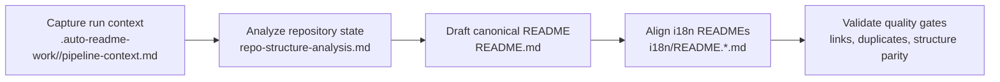

[English](../README.md) · [العربية](README.ar.md) · [Español](README.es.md) · [Français](README.fr.md) · [日本語](README.ja.md) · [한국어](README.ko.md) · [Tiếng Việt](README.vi.md) · [中文 (简体)](README.zh-Hans.md) · [中文（繁體）](README.zh-Hant.md) · [Deutsch](README.de.md) · [Русский](README.ru.md)


<table><tr><td><a href="https://github.com/lachlanchen/lachlanchen/blob/main/figs/banner.png"></a></td><td><a href="../logos/aginti-logo-wordmark.png"></a></td></tr></table>


# AgInTi

[](https://github.com/lachlanchen/AgInTi)
[](#aginti)
[](#-project-structure)
[](#-scope-and-snapshot)
[](#-license)
[](#-overview)
[](#-features)
[](#-architecture)

该仓库是一个以文档为先的脚手架：维护唯一的英文权威 README，并同步多语言文档。它遵循三项运行原则：**sear creation tools**、**self-healing tools** 与 **chain of prompt tools**。


## 🧭 快速导航

| 类型 | 入口 |
| --- | --- |
| 项目摘要 | [概览](#-overview) |
| 核心能力 | [功能](#-features) |
| 流水线设计 | [架构](#-architecture) |
| 哲学基线 | [哲学一览](#philosophy-at-a-glance) |
| 贡献者工作流 | [开发说明](#-development-notes) |
| 后续方向 | [路线图](#-roadmap) |
| 支持本项目 | [Support](#-support) |

---

## 📌 范围与快照

| 条目 | 当前状态 |
| --- | --- |
| 仓库阶段 | 文档引导脚手架 |
| 运行时代码 | 在当前快照中未检测到 |
| 测试/CI 流水线 | 在当前快照中未检测到 |
| 本地化文档 | `i18n/` 下有 10 个语言文件 |
| 流水线产物 | `.auto-readme-work/` 下按时间戳保存 |
| 许可证文件 | 尚无独立文件（README 徽章显示 `TBD`） |
| 哲学基线 | Sear creation + self-healing + chain of prompt tools |

## 🌍 概览

AgInTi 当前是一个 README 生命周期与本地化流水线，而不是运行时应用。根目录 `README.md` 是权威来源，`i18n/` 中的多语言版本都从该结构同步而来。

该项目的哲学是可执行的，不是装饰性的。每次 README 更新都应满足以下三项原则：

1. **Sear creation tools**：有意识地采用“锋利”的创建流程，基于受限仓库证据生成高信号文档。
2. **Self-healing tools**：通过修复机制消除漂移、重复与结构不一致。
3. **Chain of prompt tools**：使用分阶段且可追踪的提示流，在流水线运行中保留从上下文到输出的脉络。

该仓库通过增量编辑保留有意义的历史内容，同时维持关键链接、命令与支持元数据。

### 哲学一览

| 原则 | 意图 | 运行结果 |
| --- | --- | --- |
| **Sear creation tools** | 基于受限证据产出高信号文档。 | 各章节保持实用、具体且扎根仓库现状。 |
| **Self-healing tools** | 修复漂移、重复与陈旧结构。 | 权威 README 与各语言 README 保持对齐且整洁。 |
| **Chain of prompt tools** | 使生成阶段明确且可追踪。 | 流水线产物可保留可复现实验上下文与交接链路。 |

## ✨ 功能

- README 优先的文档策略，根文档作为唯一权威源。
- 10 种 i18n README 变体的多语言同步。
- 通过 `.auto-readme-work/<run-id>/` 产物驱动的文档生成流程。
- 采用“单横幅 + 单支持面板”约束，防止视觉区块重复。
- 通过增量更新方式保留核心技术历史。

### 原则与功能映射

| 核心原则 | 当前体现 |
| --- | --- |
| **Sear creation tools** | 基于仓库证据与稳定章节骨架进行精确 README 起草。 |
| **Self-healing tools** | 对重复 banner/support 区块、陈旧引用与结构漂移进行去重修复检查。 |
| **Chain of prompt tools** | 使用运行级产物链（`pipeline-context`、导航模板、翻译计划）实现可复现输出。 |

## 🗂️ 项目结构

```text
AgInTi/
├── README.md
├── i18n/
│   ├── README.ar.md
│   ├── README.de.md
│   ├── README.es.md
│   ├── README.fr.md
│   ├── README.ja.md
│   ├── README.ko.md
│   ├── README.ru.md
│   ├── README.vi.md
│   ├── README.zh-Hans.md
│   └── README.zh-Hant.md
└── .auto-readme-work/
    ├── 20260228_184104/
    ├── 20260301_064213/
    ├── 20260301_064740/
    ├── 20260301_065835/
    ├── 20260301_070633/
    ├── 20260302_120620/
    ├── 20260302_124338/
    ├── 20260302_140150/
    └── 20260302_140358/
```

## 🏗️ 架构

在当前阶段，这里的“架构”指文档流水线架构，而不是运行时服务架构。

### 流水线流程



### 架构中的核心原则

- **Sear creation tools**：在内容构建阶段应用，保证章节具体、完整且与仓库事实一致。
- **Self-healing tools**：在校验阶段应用，移除重复区块、修复过期运行引用并恢复结构一致性。
- **Chain of prompt tools**：贯穿各类产物，让每个生成阶段都明确且可审计。

### 按流水线阶段的原则检查点

| 阶段 | Sear creation tools | Self-healing tools | Chain of prompt tools |
| --- | --- | --- | --- |
| 上下文采集 | 设定清晰且有力度的生成约束。 | 及早标记缺失或无效输入。 | 保留源提示与运行元数据。 |
| 权威文档起草 | 基于仓库证据构建完整 README 章节。 | 防止回归与意外内容丢失。 | 让阶段输出与前序产物可追溯关联。 |
| i18n 对齐 | 跨语言保持结构与技术细节一致。 | 修复根文档与 i18n 文件之间的漂移。 | 将权威文档意图传递到各语言版本。 |
| 最终验证 | 强化可读性与细节保真。 | 去除重复 banner/support 区块与陈旧引用。 | 为本次运行保留可审计产物链。 |

## 🧾 文档输入与生成产物

| 文件 | 用途 |
| --- | --- |
| `.auto-readme-work/20260302_140358/pipeline-context.md` | 本轮生成的源约束与目标。 |
| `.auto-readme-work/20260302_140358/repo-structure-analysis.md` | 仓库扫描摘要与推断的技术状态。 |
| `.auto-readme-work/20260302_140358/language-nav-root.md` | 根 `README.md` 的权威语言导航行。 |
| `.auto-readme-work/20260302_140358/language-nav-i18n.md` | i18n README 文件的权威语言导航行。 |
| `.auto-readme-work/20260302_140358/translation-plan.txt` | 语言映射与 i18n 目标文件计划。 |
| `.auto-readme-work/<older-run-id>/...` | 以往流水线运行保留的历史上下文。 |

## 🔧 前置要求

- `git`
- POSIX shell（示例使用 `bash`）
- 支持 Markdown 的编辑器

### 假设

- 在当前仓库快照中不存在可运行服务或应用清单。
- 因此，安装、构建与启动说明面向文档维护流程。

## 📥 安装

目前尚未定义二进制包或运行时构建步骤。

```bash
git clone git@github.com:lachlanchen/AgInTi.git
cd AgInTi
```

## ▶️ 使用

当前使用方式聚焦于文档维护与多语言同步。

### 常用检查命令

```bash
ls -la
ls -la .auto-readme-work/20260302_140358
ls -la i18n
```

### 权威 README 同步流程

1. 阅读 `.auto-readme-work/20260302_140358/pipeline-context.md`。
2. 检查 `language-nav-root.md` 与 `language-nav-i18n.md` 中的语言选择模板。
3. 以增量方式更新 `README.md`，将其作为事实来源。
4. 对齐 `i18n/README.*.md` 文件结构与关键技术细节。
5. 确认仅存在一个 banner 和一个 support 面板。

## ⚙️ 配置

当前暂无运行时配置。文档行为由仓库内产物驱动。

- `pipeline-context.md`：运行目标与约束。
- `repo-structure-analysis.md`：快照证据与缺口。
- `language-nav-root.md` 与 `language-nav-i18n.md`：导航一致性。
- `translation-plan.txt`：语言目标与映射。

## 🧪 示例

### 示例 1：验证语言导航模板

```bash
cat .auto-readme-work/20260302_140358/language-nav-root.md
cat .auto-readme-work/20260302_140358/language-nav-i18n.md
```

### 示例 2：检查语言计划

```bash
cat .auto-readme-work/20260302_140358/translation-plan.txt
```

### 示例 3：确认运行时清单缺失（当前快照）

```bash
find . -maxdepth 2 \
  \( -name package.json -o -name pyproject.toml -o -name go.mod -o -name Cargo.toml -o -name pom.xml \)
```

## 🛠️ 开发说明

- 保留权威 README 历史中的实质性章节与链接。
- 优先进行增量编辑，避免破坏性重写。
- 仅保留一个 banner 与一个 support 区块。
- 保持根 README 与 i18n README 结构同步。
- 当运行时或基础设施细节未知时，明确说明假设。
- 将三项哲学作为主动护栏：
  - **Sear creation tools**：用于高信号内容起草。
  - **Self-healing tools**：用于一致性修复。
  - **Chain of prompt tools**：用于流水线阶段间可复现交接。

## 🚑 故障排查

### 我只看到 Markdown 文件和流水线产物

这是当前引导阶段的预期状态。

### 不同文件中的语言选择行不一致

请使用以下权威模板：

- `.auto-readme-work/20260302_140358/language-nav-root.md`
- `.auto-readme-work/20260302_140358/language-nav-i18n.md`

### 我的分支落后了

```bash
git fetch origin
git pull --ff-only
```

### 我想补充运行时说明

仅在引入具体清单文件（例如：`package.json`、`pyproject.toml`、`go.mod`、`Cargo.toml`）并确认其路径后，再添加构建与运行说明。

## 🗺️ 路线图

1. 通过标准化 README 起草模板、章节质量门禁和更清晰的证据到输出检查，强化 **sear creation tools**。
2. 通过自动化检查重复区块、失效锚点、语言漂移与过期运行引用，扩展 **self-healing tools**。
3. 跨运行阶段规范 **chain of prompt tools** 的产物契约，确保多语言输出可复现。
4. 在仓库引入脚本后，提供单命令文档维护流程。
5. 增加 Markdown 质量、链接完整性与 i18n 结构一致性的 CI 检查。
6. 在新增源清单与入口点后，引入具体的运行时组件。
7. 发布稳定的许可证决策，并添加独立许可证文件。

### 按原则聚焦的路线图

| 聚焦方向 | 近期目标 |
| --- | --- |
| **Sear creation tools** | 改进起草模板与基于证据的章节提示。 |
| **Self-healing tools** | 自动化重复检测、过期锚点检查与语言漂移修复。 |
| **Chain of prompt tools** | 标准化运行阶段产物契约，实现可复现的多语言输出。 |

## 🤝 贡献

欢迎贡献。

1. 先创建 issue 说明预期变更。
2. 创建聚焦的分支。
3. 让文档编辑保持增量且与仓库事实一致。
4. 保留重要链接、命令与实质性历史上下文。
5. 提交 pull request，并附上简明验证说明。

### 建议流程

```bash
git checkout -b docs/your-update
# edit README.md and/or i18n/README.*.md
git add README.md i18n/README.*.md
git commit -m "docs: refine README content"
git push -u origin docs/your-update
```

## 📄 许可证

TBD。计划添加独立许可证文件，但在当前快照中尚不存在。


## 🔗 Git Submodules

This repository includes these root submodules:

- [AutoAppDev](https://github.com/lachlanchen/AutoAppDev)
- [AutoNovelWriter](https://github.com/lachlanchen/AutoNovelWriter)
- [OrganoidAgent](https://github.com/lachlanchen/OrganoidAgent)
- [LazyingArtBot](https://github.com/lachlanchen/LazyingArtBot)
- [PaperAgent](https://github.com/lachlanchen/PaperAgent)

## ❤️ Support

| Donate | PayPal | Stripe |
| --- | --- | --- |
| [](https://chat.lazying.art/donate) | [](https://paypal.me/RongzhouChen) | [](https://buy.stripe.com/aFadR8gIaflgfQV6T4fw400) |
