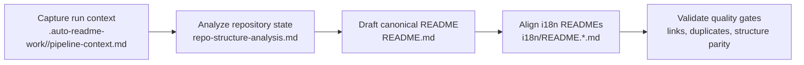

[English](../README.md) · [العربية](README.ar.md) · [Español](README.es.md) · [Français](README.fr.md) · [日本語](README.ja.md) · [한국어](README.ko.md) · [Tiếng Việt](README.vi.md) · [中文 (简体)](README.zh-Hans.md) · [中文（繁體）](README.zh-Hant.md) · [Deutsch](README.de.md) · [Русский](README.ru.md)


[](https://github.com/lachlanchen/lachlanchen/blob/main/figs/banner.png)

# AgInTi

[](https://github.com/lachlanchen/AgInTi)
[](#aginti)
[](#-project-structure)
[](#-scope-and-snapshot)
[](#-license)
[](#-overview)
[](#-features)
[](#-architecture)

這是一個以文件為先的倉庫骨架：維護一份英文標準 README，並同步多語系文件；其核心由三項運作原則驅動：**sear creation tools**、**self-healing tools**、以及 **chain of prompt tools**。

## 🧭 Quick Navigation

| Type | Destination |
| --- | --- |
| 專案摘要 | [Overview](#-overview) |
| 核心能力 | [Features](#-features) |
| 流水線設計 | [Architecture](#-architecture) |
| 哲學基準 | [Philosophy at a glance](#philosophy-at-a-glance) |
| 貢獻者工作流程 | [Development Notes](#-development-notes) |
| 未來方向 | [Roadmap](#-roadmap) |
| 支持此專案 | [Support](#-support) |

---

## 📌 Scope and Snapshot

| Item | Current state |
| --- | --- |
| 倉庫階段 | 文件啟動（bootstrap）骨架 |
| 執行期程式碼 | 在目前快照中未偵測到 |
| 測試/CI 流水線 | 在目前快照中未偵測到 |
| 在地化文件 | `i18n/` 下有 10 個語系檔 |
| 流水線產物 | `.auto-readme-work/` 下的時間戳執行目錄 |
| 授權檔案 | 尚未有獨立檔案（README 徽章顯示 `TBD`） |
| 哲學基準 | Sear creation + self-healing + chain of prompt tools |

## 🌍 Overview

AgInTi 目前的定位是 README 生命週期與在地化流水線，而非可執行的應用程式。根目錄 `README.md` 是標準來源，`i18n/` 內的各語系版本由該標準結構同步而來。

本專案的哲學重點在於可操作性，而非裝飾性。每次 README 更新都應滿足以下三項原則：

1. **Sear creation tools**：以刻意且高精度的創建流程，在受限的倉庫證據上產出高訊號文件。
2. **Self-healing tools**：以修復為導向，消除漂移、重複與結構不一致。
3. **Chain of prompt tools**：以分階段且可追溯的提示流程，保留從上下文到輸出的沿襲關係。

此倉庫透過漸進式編輯保留有意義的歷史內容，同時維持關鍵連結、命令與支援中繼資料。

### Philosophy at a glance

| Principle | Intent | Operational outcome |
| --- | --- | --- |
| **Sear creation tools** | 從受限證據中產出高訊號文件。 | 章節保持實用、具體，並緊貼倉庫現況。 |
| **Self-healing tools** | 修復漂移、重複與過時結構。 | 標準與多語 README 能持續對齊且整潔。 |
| **Chain of prompt tools** | 使生成階段保持明確且可追溯。 | 流水線產物可保留可重現的上下文與交接。 |

## ✨ Features

- README-first 文件策略，以根文件作為標準來源。
- 10 個 i18n README 版本的多語同步。
- 透過 `.auto-readme-work/<run-id>/` 產物進行流水線式撰寫。
- 單一 Banner 與單一 Support 區塊不變式，避免視覺區塊重複。
- 以漸進更新紀律保留具實質意義的技術歷史。

### Principle-to-feature mapping

| Core principle | Current manifestation |
| --- | --- |
| **Sear creation tools** | 基於倉庫證據與穩定章節骨架，精準草擬 README。 |
| **Self-healing tools** | 針對重複 banner/support 區塊、過時參考與結構漂移進行去重檢查。 |
| **Chain of prompt tools** | 以執行次序串連產物（`pipeline-context`、導覽模板、翻譯計畫）以確保輸出可重現。 |

## 🗂️ Project Structure

```text
AgInTi/
├── README.md
├── i18n/
│   ├── README.ar.md
│   ├── README.de.md
│   ├── README.es.md
│   ├── README.fr.md
│   ├── README.ja.md
│   ├── README.ko.md
│   ├── README.ru.md
│   ├── README.vi.md
│   ├── README.zh-Hans.md
│   └── README.zh-Hant.md
└── .auto-readme-work/
    ├── 20260228_184104/
    ├── 20260301_064213/
    ├── 20260301_064740/
    ├── 20260301_065835/
    ├── 20260301_070633/
    ├── 20260302_120620/
    ├── 20260302_124338/
    ├── 20260302_140150/
    └── 20260302_140358/
```

## 🏗️ Architecture

在現階段，這裡的架構指的是文件流水線架構，而不是執行期服務架構。

### Pipeline flow



### Core principles in architecture

- **Sear creation tools**：套用於內容建構階段，讓章節保持具體、完整且符合倉庫實況。
- **Self-healing tools**：套用於驗證階段，移除重複區塊、修復過時執行參考，並恢復結構對齊。
- **Chain of prompt tools**：跨產物套用，讓每個生成階段都保持明確且可稽核。

### Principle checkpoints by pipeline stage

| Stage | Sear creation tools | Self-healing tools | Chain of prompt tools |
| --- | --- | --- | --- |
| Context capture | 定義明確且高精度的生成限制。 | 及早標記缺失或無效輸入。 | 保留來源提示與執行中繼資料。 |
| Canonical drafting | 以倉庫證據建構完整 README 章節。 | 防止回歸與意外內容流失。 | 讓階段輸出與先前產物保持鏈結。 |
| i18n alignment | 維持各語系在結構與技術細節上的一致性。 | 修正根 README 與 i18n 檔案間的漂移。 | 將標準文件意圖延伸到每個在地化版本。 |
| Final verification | 強制可讀性與細節保留。 | 移除重複 banner/support 區塊與過時參考。 | 為本次執行留下可稽核的產物軌跡。 |

## 🧾 Documentation Inputs and Generated Artifacts

| File | Purpose |
| --- | --- |
| `.auto-readme-work/20260302_140358/pipeline-context.md` | 本次生成流程的來源限制與目標。 |
| `.auto-readme-work/20260302_140358/repo-structure-analysis.md` | 倉庫掃描摘要與推定技術狀態。 |
| `.auto-readme-work/20260302_140358/language-nav-root.md` | 根 `README.md` 的標準語言選項列。 |
| `.auto-readme-work/20260302_140358/language-nav-i18n.md` | i18n README 檔案的標準語言選項列。 |
| `.auto-readme-work/20260302_140358/translation-plan.txt` | 語系對應與 i18n 目標檔案規劃。 |
| `.auto-readme-work/<older-run-id>/...` | 先前流水線執行留下的歷史上下文。 |

## 🔧 Prerequisites

- `git`
- POSIX shell（範例使用 `bash`）
- 支援 Markdown 的編輯器

### Assumptions

- 在此倉庫快照中，不存在可執行服務或應用程式描述檔。
- 因此，安裝、建置與啟動指引皆以文件維運流程為主。

## 📥 Installation

目前尚未定義二進位套件或執行期建置步驟。

```bash
git clone git@github.com:lachlanchen/AgInTi.git
cd AgInTi
```

## ▶️ Usage

目前使用方式聚焦於文件維護與多語同步。

### Common inspection commands

```bash
ls -la
ls -la .auto-readme-work/20260302_140358
ls -la i18n
```

### Canonical README synchronization workflow

1. 閱讀 `.auto-readme-work/20260302_140358/pipeline-context.md`。
2. 檢查 `language-nav-root.md` 與 `language-nav-i18n.md` 的語言選擇器模板。
3. 以 `README.md` 為事實來源，進行漸進式更新。
4. 將 `i18n/README.*.md` 對齊到相同結構與關鍵技術細節。
5. 確認僅有一個 banner 與一個 support 區塊。

## ⚙️ Configuration

目前尚無執行期設定。文件行為由倉庫產物驅動。

- `pipeline-context.md`：執行目標與限制。
- `repo-structure-analysis.md`：快照證據與缺口。
- `language-nav-root.md` 與 `language-nav-i18n.md`：導覽一致性。
- `translation-plan.txt`：語系列表與對應關係。

## 🧪 Examples

### Example 1: Verify language navigation templates

```bash
cat .auto-readme-work/20260302_140358/language-nav-root.md
cat .auto-readme-work/20260302_140358/language-nav-i18n.md
```

### Example 2: Check locale plan

```bash
cat .auto-readme-work/20260302_140358/translation-plan.txt
```

### Example 3: Confirm runtime-manifest absence (current snapshot)

```bash
find . -maxdepth 2 \
  \( -name package.json -o -name pyproject.toml -o -name go.mod -o -name Cargo.toml -o -name pom.xml \)
```

## 🛠️ Development Notes

- 保留標準 README 歷史中的實質章節與連結。
- 優先採用漸進式編輯，而非破壞性重寫。
- 僅保留一個 banner 與一個 support 區塊。
- 維持根 README 與 i18n README 結構同步。
- 任何執行期或基礎設施細節不明時，需明確說明假設。
- 將哲學三要素作為主動防護欄：
  - **Sear creation tools** 用於高訊號草擬。
  - **Self-healing tools** 用於一致性修復。
  - **Chain of prompt tools** 用於在流水線階段間可重現的交接。

## 🚑 Troubleshooting

### I only see Markdown files and pipeline artifacts

這是目前 bootstrap 階段的預期狀態。

### Language selector lines differ between files

請使用以下標準模板：

- `.auto-readme-work/20260302_140358/language-nav-root.md`
- `.auto-readme-work/20260302_140358/language-nav-i18n.md`

### My branch is behind

```bash
git fetch origin
git pull --ff-only
```

### I want to add runtime instructions

只有在導入明確的描述檔（例如：`package.json`、`pyproject.toml`、`go.mod`、`Cargo.toml`）並確認其路徑存在於此倉庫後，才新增建置與執行說明。

## 🗺️ Roadmap

1. 強化 **sear creation tools**，導入標準化 README 草擬模板、章節品質閘門與更清楚的證據到輸出檢查。
2. 擴展 **self-healing tools**，加入重複區塊、語系漂移、內部錨點失效與過時執行參考的自動檢查。
3. 正式化跨執行階段的 **chain of prompt tools**，使上下文、生成、翻譯與驗證軌跡可重現。
4. 待倉庫導入腳本後，新增單指令文件維運流程。
5. 加入 Markdown 品質、連結完整性與 i18n 結構一致性的 CI 檢查。
6. 當導入來源描述檔與 entrypoint 後，引入具體執行期元件。
7. 發布穩定授權決策，並新增獨立授權檔案。

### Roadmap by principle focus

| Focus area | Near-term target |
| --- | --- |
| **Sear creation tools** | 改善草擬模板與以證據為基礎的章節提示。 |
| **Self-healing tools** | 自動化重複偵測、過時錨點檢查與語系漂移修復。 |
| **Chain of prompt tools** | 標準化執行階段產物契約，以產出可重現的多語文件。 |

## 🤝 Contribution

歡迎貢獻。

1. 先開 issue 說明預期變更。
2. 建立聚焦的分支。
3. 文件修改請保持漸進且符合倉庫現況。
4. 保留重要連結、命令與具實質意義的歷史上下文。
5. 送出 pull request，並附上精簡的驗證說明。

### Suggested flow

```bash
git checkout -b docs/your-update
# edit README.md and/or i18n/README.*.md
git add README.md i18n/README.*.md
git commit -m "docs: refine README content"
git push -u origin docs/your-update
```

## 🔗 Git Submodules

This repository includes these root submodules:

- [AutoAppDev](https://github.com/lachlanchen/AutoAppDev)
- [AutoNovelWriter](https://github.com/lachlanchen/AutoNovelWriter)
- [OrganoidAgent](https://github.com/lachlanchen/OrganoidAgent)
- [LazyingArtBot](https://github.com/lachlanchen/LazyingArtBot)
- [PaperAgent](https://github.com/lachlanchen/PaperAgent)

## ❤️ Support

| Donate | PayPal | Stripe |
| --- | --- | --- |
| [](https://chat.lazying.art/donate) | [](https://paypal.me/RongzhouChen) | [](https://buy.stripe.com/aFadR8gIaflgfQV6T4fw400) |

## 📄 License

TBD。預計新增獨立授權檔案，但在目前快照中尚未提供。
