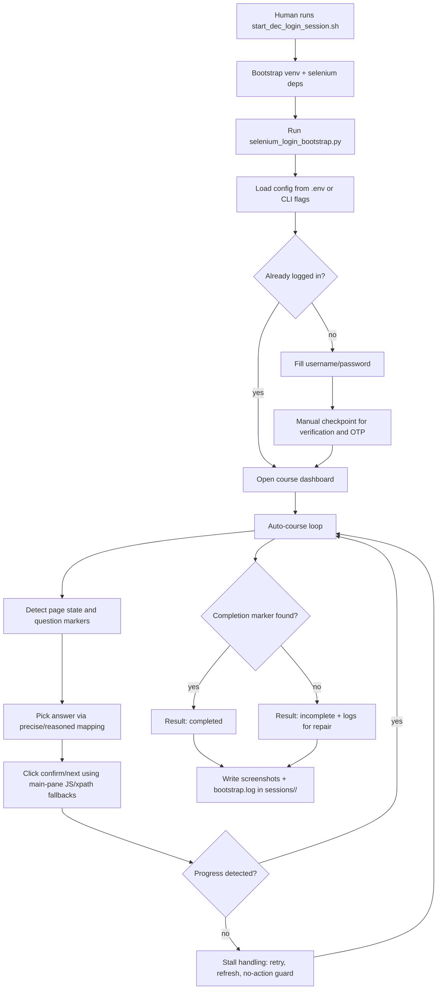
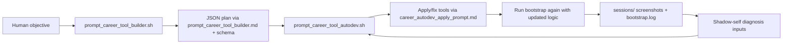

# Career Agent Tools

This module is a dedicated prompt-tool stack for:

- finishing online courses (with manual login checkpoints)
- maintaining a LinkedIn profile/workflow
- auto-generating and auto-repairing dedicated scripts for those tasks

## Files

- `start_dec_login_session.sh`
- `selenium_login_bootstrap.py`
- `prompt_career_tool_builder.sh`
- `prompt_career_tool_builder.md`
- `career_tool_builder_schema.json`
- `prompt_career_tool_autodev.sh`
- `career_autodev_apply_prompt.md`
- `.env` (ignored)
- `env.example`

## Runtime reuse

This module reuses existing shared runners:

- `lab_prompt_tools/runtime/codex-json-runner.py`
- `lab_prompt_tools/runtime/codex-noninteractive.sh`

## Quick start

1. Start manual login bootstrap:

```bash
/Users/lachlan/Local/Clawbot/AgInTi/lab_prompt_tools/career/start_dec_login_session.sh
```

2. Build a tool plan:

```bash
/Users/lachlan/Local/Clawbot/AgInTi/lab_prompt_tools/career/prompt_career_tool_builder.sh \
  --objective "Finish DEC online course and keep LinkedIn updated weekly"
```

3. Run autodev (plan + apply/fix):

```bash
/Users/lachlan/Local/Clawbot/AgInTi/lab_prompt_tools/career/prompt_career_tool_autodev.sh \
  --objective "Finish DEC online course and maintain LinkedIn"
```

## Logic map (HKU DEC course agent)




